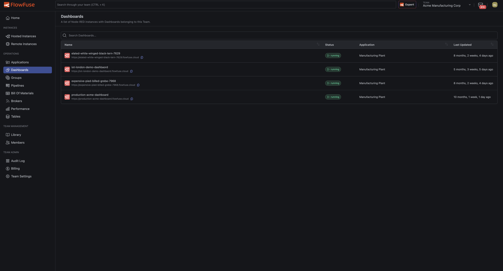
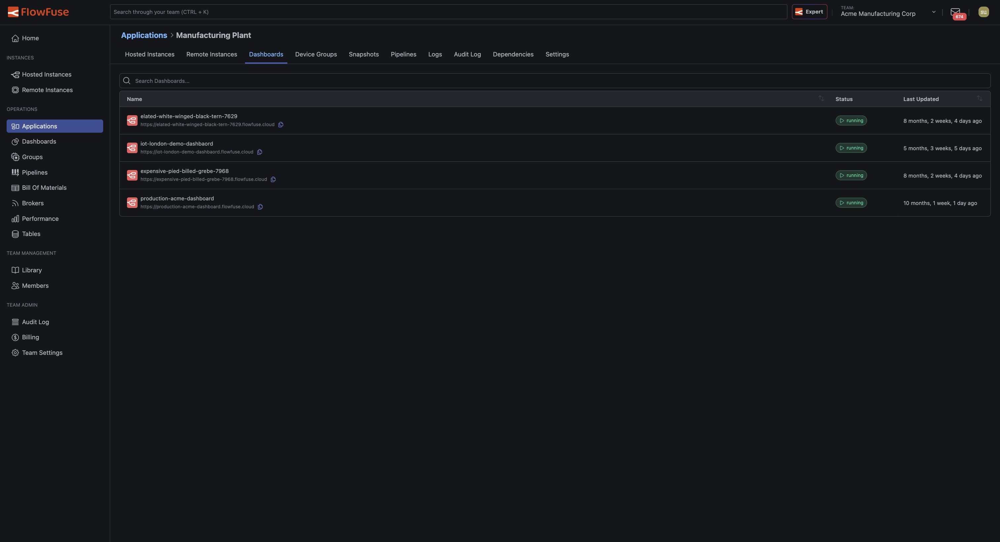
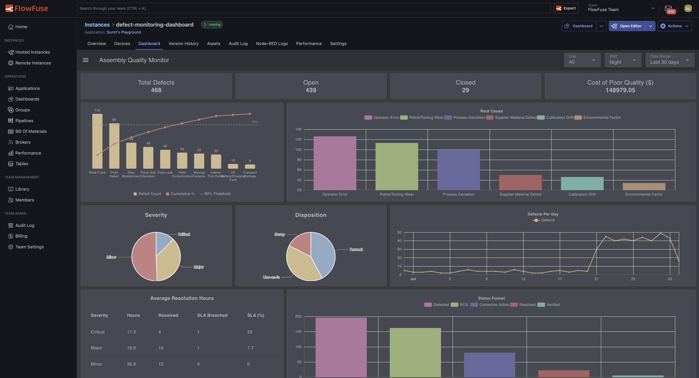
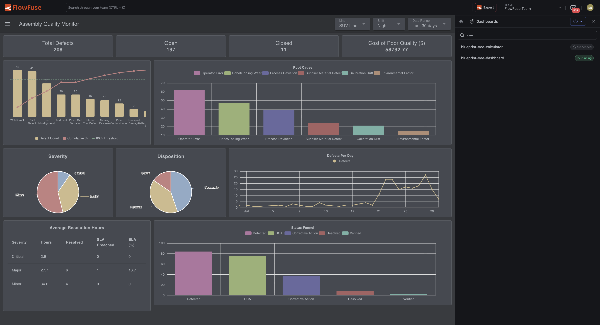

# Dashboards

Any hosted instance running the [FlowFuse Dashboard](https://dashboard.flowfuse.com) can be viewed directly inside FlowFuse, without opening a separate browser tab.

*This does not apply to Remote Instances (devices) - Dashboards are only listed and viewable here for hosted instances.*

## Team Dashboards

Click **Dashboards** in the Team navigation to see every hosted instance in the Team that has a Dashboard installed, regardless of which Application it belongs to.

{data-zoomable}

The list shows each instance's name, status, the Application it belongs to, and when its flows were last updated. Click a row to open that instance's Dashboard.

Members with the **Dashboard Only** role land on this page, scoped to only the instances they have access to.

## Application Dashboards

Each Application has its own **Dashboards** tab, showing only the Dashboards belonging to instances within that Application.

{data-zoomable}

## Instance Dashboard Tab

An individual hosted instance's page has a **Dashboard** tab, for viewing its Dashboard without leaving the instance's context.

{data-zoomable}

## Viewing a Dashboard

Opening a Dashboard displays it embedded inside FlowFuse. A drawer alongside it lists every other Dashboard available in the current scope (Team or Application), with a search box to find one by name. Click any entry in the drawer to switch to that Dashboard directly.

{data-zoomable}

Use the icon in the top-right of the drawer to collapse or reopen it.

To open a Dashboard in its own browser tab instead, use the **Dashboard** button's dropdown arrow on an instance's page and select **Open Direct URL**.

## Requirements

- The instance must be **running** for its Dashboard to be viewable.
- The instance must have the [FlowFuse Dashboard](https://dashboard.flowfuse.com) node installed and configured in its flows. Instances without a Dashboard configured do not appear in these lists.
