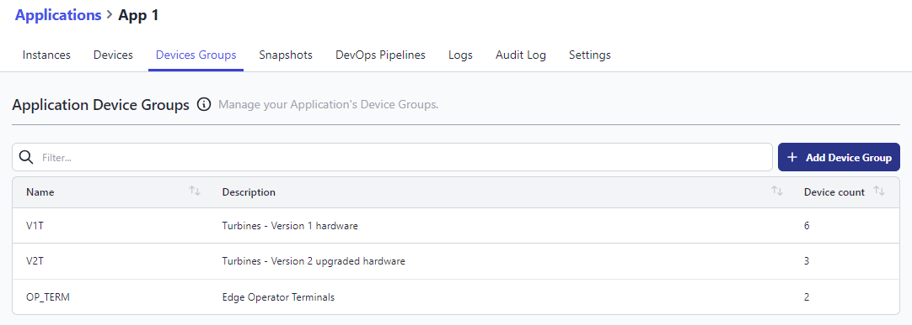
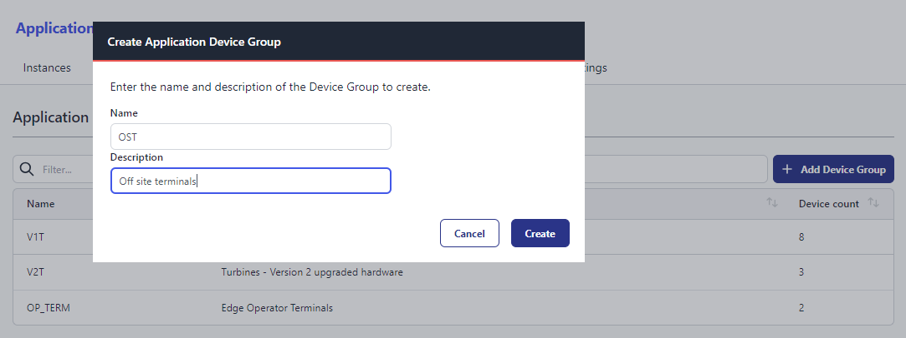
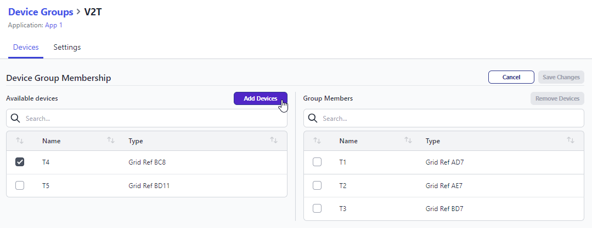

# Device Groups

**Navigation**: `Team > Application > Device Groups`

When managing many devices that are intended to run the same [snapshot](./snapshots.md), Device Groups allow you
to organise your devices into logical groups.
These groups can then be set as the target of a [DevOps Pipelines](./devops-pipelines.md).

Furthermore:
* Devices added to an active Device Group will automatically be updated to the active pipeline snapshot
* Devices removed from an active Device Group will have their active pipeline snapshot cleared
More details are provided below in [Adding a Device to a group](#adding-a-device-to-a-group-which-has-an-active-pipeline-snapshot) and [Removing a Device from a group](#removing-a-device-from-a-group-which-has-an-active-pipeline-snapshot)

This greatly simplifies deployments of the same configuration to one or even hundreds of devices with a single click.

The following requirements apply:

- FlowFuse 1.15+ Enterprise Tier
- FlowFuse Cloud teams on the Enterprise tier

## Creating a Device Group

1. Select the Application you want to configure a Device Group for.
1. Select the "Device Groups" tab
1. Click "Add Device Group"
1. Name your Device Group appropriately (this can be changed later)
1. Click "Create"

_Note: Adding a description can help you better distinguish device groups._

## Updating Device Group Membership

1. In the Device Groups table, click the Device Group you want to modify
1. Click "Edit"
   1. On the left, you will be shown available devices (ones that are assigned to your application and are available to be added to a device group)
   1. On the right, you will be shown devices that are already in the device group
1. Place a checkmark next to the devices in the Available Devices list that you want to add to the Device Group then click "Add Devices"
1. Place a checkmark next to the devices in the Device Group list that you want to remove then click "Remove Devices"
1. Click "Save"
1. You will be prompted to confirm your changes
   1. Refer to the below information for more details about what happens when you add or remove devices from a device group
   1. Click "Confirm" to continue or "Cancel" to abort

_Note: If you make a mistake, you can cancel your changes at any time by clicking "Cancel"_
_Note: When a device you want to add to a group doesn't appear in the list, it's likely already assigned to another group._

### Adding a Device to a group which has an active pipeline snapshot

When a pipeline stage is operated and it deploys to a device group, that device group remembers the snapshot that was deployed.

Subsequently, if you add a device to a group, it will be instructed to update to the active snapshot.

### Removing a Device from a group which has an active pipeline snapshot

When a pipeline stage is operated and it deploys to a device group, that device group remembers the snapshot that was deployed.

Subsequently, if you remove a device from a group and the device is running the active pipeline snapshot,
the device snapshot will be cleared, effectively resetting the device to a blank state.

### Removing the snapshot from a device group

Under the settings of a device group, you can remove the target snapshot. This will also clear the snapshot of all devices in the group.
