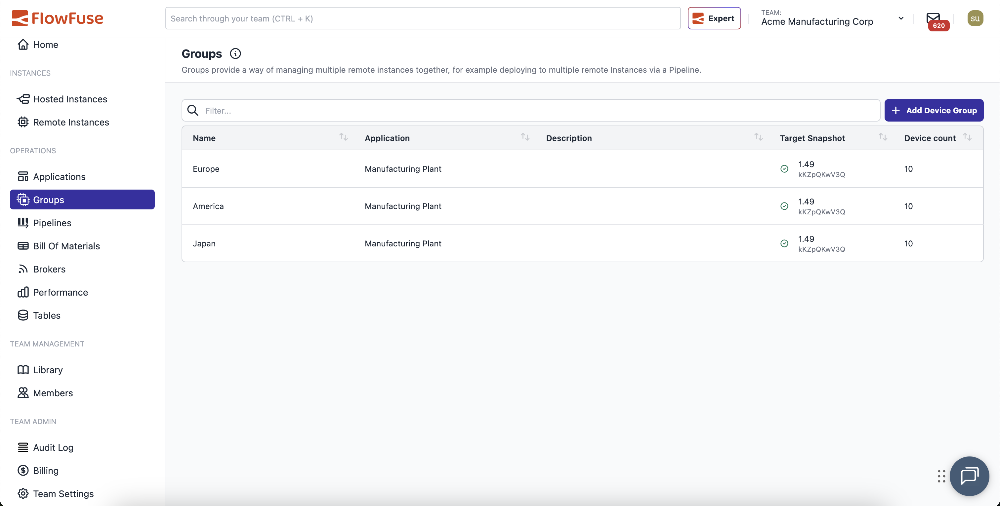
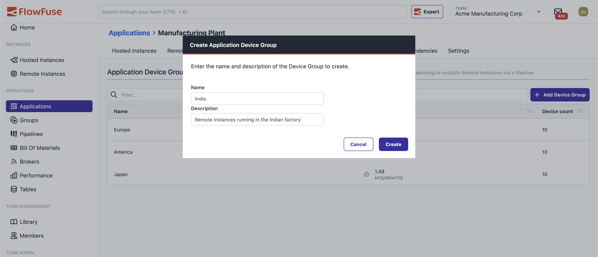

# Groups

**Navigation**: Team > Application > Groups

## Overview

{data-zoomable}

Groups help you organize and manage multiple devices that run the same [snapshot](./snapshots.md) configuration. By grouping devices logically, you can deploy updates to dozens or even hundreds of devices simultaneously through [DevOps Pipelines](./devops-pipelines.md).

### Key Features

**Automatic Updates**
- Devices added to an active group automatically receive the current pipeline snapshot
- Devices removed from an active group have their snapshot cleared

**Group-Level Environment Variables**
- Set environment variables at the group level that apply to all member devices
- Device-specific variables take precedence over group variables
- Variables are merged at runtime without modifying device settings
- Updates to group variables trigger automatic device restarts

### Requirements

- FlowFuse 1.15+ (Enterprise Tier)
- FlowFuse Cloud (Enterprise Tier)
- FlowFuse 2.10+ for Group Environment Variables

## Creating a Group

{data-zoomable}

1. Navigate to your Application
2. Select the **Groups** tab
3. Click **Add Group**
4. Enter a descriptive name for your group
5. (Optional) Add a description to help distinguish between groups
6. Click **Create**

## Managing Group Membership

### Adding and Removing Devices

{data-zoomable}

1. Click the group you want to modify from the table
2. Click **Edit**
3. Review the two lists:
   - **Available Devices** (left): Devices assigned to your application that can be added
   - **Group** (right): Devices currently in the group
4. To add devices: Check the boxes next to devices in the Available list, then click **Add Devices**
5. To remove devices: Check the boxes next to devices in the Group list, then click **Remove Devices**
6. Click **Save**
7. Review the confirmation prompt and click **Confirm** to apply changes

**Note**: If a device doesn't appear in the Available list, it's likely already assigned to another group.

### How Snapshots Are Affected

**When Adding a Device**

If the group has an active pipeline snapshot, newly added devices will automatically be updated to that snapshot.

**When Removing a Device**

If the group has an active pipeline snapshot and the device is currently running it, removing the device will clear its snapshot, effectively resetting it to a blank state.

**Clearing Group Snapshots**

You can remove the target snapshot from a group in the group settings. This will also clear the snapshot from all devices in the group.

## Environment Variables

Group-level environment variables follow these rules:

- **Precedence**: Device variables override group variables
- **Scope**: Variables are merged at runtime only; device settings remain unchanged
- **Removal**: Removing a device from a group removes the group's variables from that device
- **Updates**: Changing group variables triggers a restart of all devices in the group
