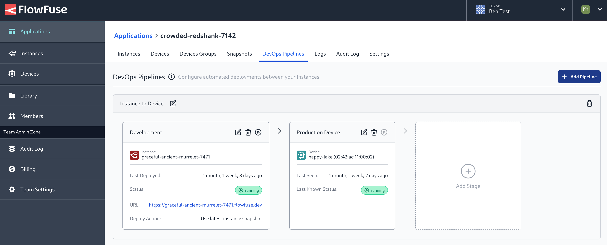
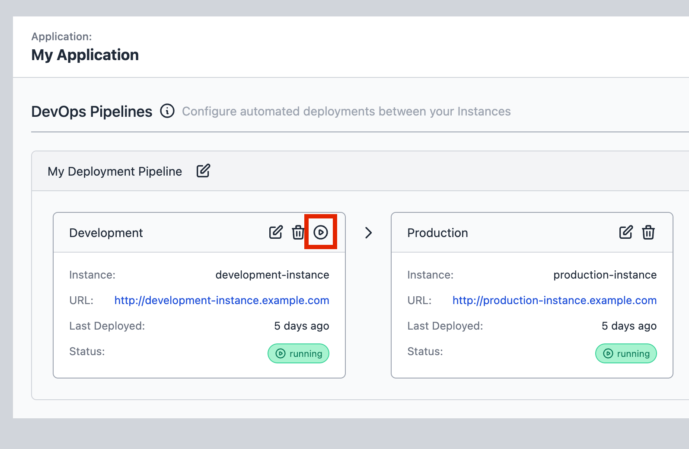
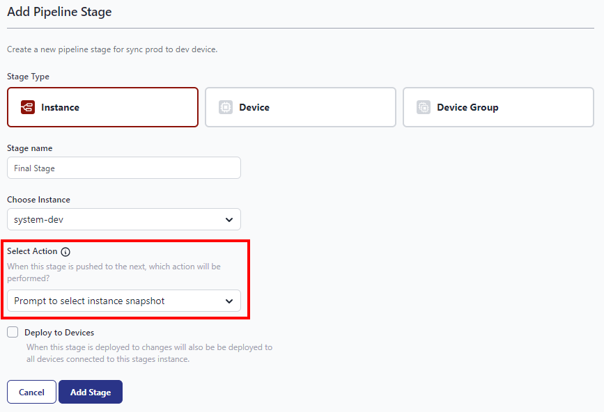
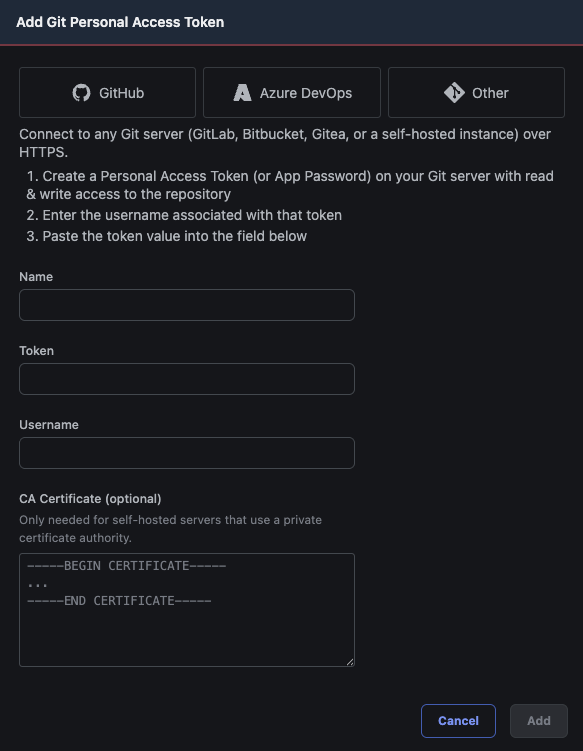
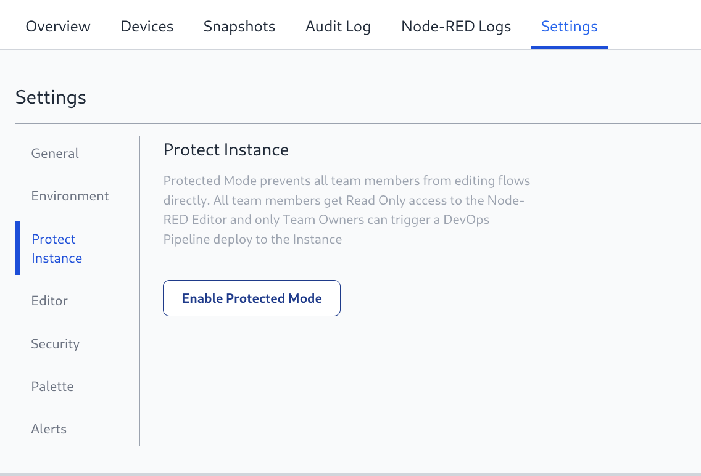
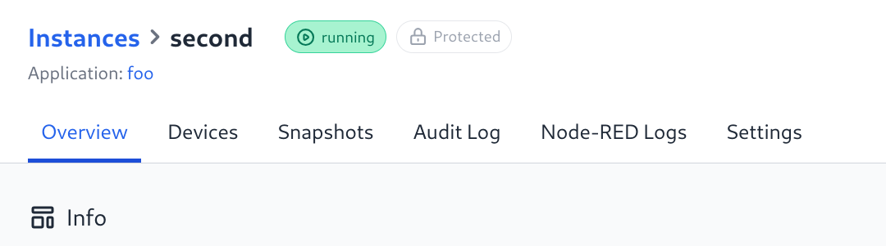

# DevOps Pipelines

**Navigation**: `Team > Application > Pipelines`

{data-zoomable}

In FlowFuse it is possible to configure a DevOps pipeline for your Node-RED instances.
DevOps Pipelines allow you to easily deploy from one instance to another, most
commonly used for having an unstable/experimental "Development" instance, and a more stable
"Production" instance.

The pipeline then allows you to move your full flow and configuration along from "Development"
to "Production" once it's ready.

You can configure this in FlowFuse from the Application screen. Note you will need to have created
any Instances you wish to include in the Pipeline before being able to add them to a Pipeline.

## Creating a Pipeline

1. Select the Application you want to configure a Pipeline for.
2. Ensure an instance is created for each stage you plan to create, e.g. development, QA, and production.
   1. For the instance you want to duplicate go to the **Settings** tab
   2. Click **Duplicate Instance** and provide the necessary details
3. Select the "DevOps Pipelines" tab
4. Select "Add Pipeline"
5. Name your pipeline appropriately (this can be changed later)
6. Select "Add Stage"
7. Define your Stage's name, select the [Stage Type](#stage-types) and select an [Action](#actions).
8. Click "Add Stage"
9. Repeat 5. - 7. for as many stages as you need.

See [Pipeline Stage details](#pipeline-stage-details) below for more info.

## Running a Pipeline Stage

{data-zoomable}

Each stage currently is deployed manually. To do so, click the "play" icon on the source stage. In the example above,
it will push from the "Development" stage to the "Production" stage.

**Environment Variables** - When pushing to a next stage, _**only your environment variable keys
will be copied over**_. Values must be set on the next Stage's Instance explicitly.

**Instance Settings** - None of your Instance Settings will be copied over (e.g. Editor, Palette or Security Settings).

This ensures a split between your staging environments.

## Pipeline Stage details

* Stages of a pipeline are executed from left to right.
* Actionable stages have a play button that will push from that stage to the next stage.
* Every stage, except the last one, is effectively a source stage that can be pulled _from_.
* Every stage, except the first one, is a target stage that can be pushed _to_.
* You cannot currently insert a Stage into the middle of a Pipeline, only at the end.

### Stage Types

There are four types of stage to chose from:
1. **[Instance](./concepts.md#hosted-instance)** - a single Node-RED instance.
2. **[Device](./concepts.md#remote-instance)** - a single remote instance.
3. **[Device Group](./concepts.md#device-groups)** - a group of remote instances.
4. **Git Repository** - a remote Git repository.
    - This stage supports GitHub, Azure DevOps, and any other Git server accessible over HTTPS (for example GitLab, Bitbucket, Gitea, or a self-hosted instance).

### Actions

{data-zoomable}

The action defines what happens when the stage is deployed. 
The available actions depend on the stage type selected for the stage.
These are listed below.

#### Instance stage actions

- **Create new instance snapshot** - A new snapshot of the instance will be created and pushed to the next stage.

- **Use latest instance snapshot** - The latest existing snapshot of the instance will be pushed to the next stage.

- **Prompt to select instance snapshot** - You will be prompted to choose which snapshot to push to the next stage.

#### Device stage action

- **Use active snapshot** - The active snapshot of the device will be pushed to the next stage.

- **Use latest device snapshot** - The latest snapshot of the device will be pushed to the next stage.

- **Prompt to select device snapshot** - You will be prompted to choose which snapshot to push to the next stage.

#### Device Group stage

When a Device Group stage is triggered, it will push the current active snapshot of the group to the next stage.

#### Git Repository stage

Git Repository stages can be used to push and pull snapshots to and from a remote Git repository. FlowFuse supports GitHub, Azure DevOps, and any other Git server that is accessible over HTTPS, for example GitLab, Bitbucket, Gitea, or a self-hosted instance.

> This feature is available to Team and Enterprise tier teams on FlowFuse Cloud, and to Enterprise licensed self-hosted installations from version 2.32 onwards. Support for generic HTTPS Git servers (anything other than GitHub and Azure DevOps) requires version 2.32 or later.

##### Adding a Git token

Before you can create a Git Repository stage, you need to add a token that grants FlowFuse access to your repository. Tokens are managed per team, under `Team > Team Settings > Integrations`.

1. Go to **Team Settings** and open the **Integrations** tab.
2. In the Git integration section, click **Add Token**.
3. In the **Add Git Personal Access Token** popup, choose the tab that matches your Git server (**GitHub**, **Azure DevOps**, or **Other**) and follow the instructions for that provider (below).
4. Give the token a **Name**, complete the required fields, and click **Add**.

{data-zoomable}

###### GitHub

1. Open GitHub Personal Access Tokens Settings.
2. Click on **Generate a new token**.
3. Select the **Only select repositories** option and pick which repositories to grant access to.
4. Expand the **Repository permissions** section and ensure the **Contents** option is set to **Read and write**.
5. Click on **Generate token**.
6. This will be the only time GitHub shows you the token value. Copy the token into the **Token** field.

###### Azure DevOps

1. Open `https://dev.azure.com/[org-name]/_usersSettings/tokens` to create a new Personal Access Token.
2. Click the **+ New Token** button.
3. Give the token a name and set the **Expiry** date.
4. Select **Custom defined** for the Scopes.
5. Check **Read & Write** in the **Code** section.
6. Hit **Save**.
7. This will be the only time Azure shows you the token value. Copy the token into the **Token** field.

###### Other

Use this tab to connect to any Git server (GitLab, Bitbucket, Gitea, or a self-hosted instance) over HTTPS.

1. Create a Personal Access Token (or App Password) on your Git server with read & write access to the repository.
2. Enter the **Username** associated with that token.
3. Paste the token value into the **Token** field.
4. **CA Certificate (optional)**: only needed for self-hosted servers that use a private certificate authority. Paste the certificate (in PEM format, including the `-----BEGIN CERTIFICATE-----` and `-----END CERTIFICATE-----` lines) into this field so that FlowFuse can trust the connection. No changes to your infrastructure are required.

##### Configuring the stage

When adding a Git Repository stage, select the token you created and enter the repository URL (for example `https://github.com/your-org/nodered-flows.git`). The stage can be configured with the branch to push/pull from as well as the filename to use for the snapshot.

If a filename is not configured, it will generate the filename when pushing to the repository based on the name of Instance, Device
or Device Group that provided the snapshot. The provided filename can include directory structures, allowing the snapshot to be stored in a subdirectory of the repository.

When pulling from a repository, if the stage has not previously been used to push to the repository, the filename is a required property.

It is also possible to configure the stage with different branches for the push and pull actions. This enables a Git-based review process as part of the pipeline; using a Pull Request process to review and approve the changes before merging between the two branches.

#### Deploy to Devices

This option is only applicable when the Stage Type is an Instance.

When a pipeline stage with this action is deployed to, the same snapshot will be deployed to all devices connected to the defined instance.

## Protected Instances

It is now possible to mark an instance as Protected. This means that all team members (including Owners) only have Read Only access to the Node-RED Editor
and updates to the flows can only be made by a Team Owner running a DevOps pipeline that targets the instance.

Protected mode is activated under Instance > Settings > Protect Instance

{data-zoomable}

A Protected Instance will be marked by a status badge next to it's running state. Click on this badge will take you to the Settings page.

{data-zoomable}
