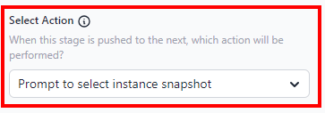

# DevOps Pipelines

**Navigation**: `Team > Application > Pipelines`

In FlowFuse it is possible to configure a DevOps pipeline for your Node-RED instances.
DevOps Pipelines allow you to easily deploy from one instance to another, most
commonly used for having an unstable/experimental "Development" instance, and a more stable
"Production" instance.

The pipeline then allows you to move your full flow and configuration along from "Development"
to "Production" once it's ready.

You can configure this in FlowFuse from the Application screen. Note you will need to have created
any Instances you wish to include in the Pipeline before being able to add them to a Pipeline.

## Creating a Pipeline

1. Select the Application you want to configure a Pipeline for.
2. Ensure an instance is created for each stage you plan to create, e.g. development, QA, and production.
   1. For the instance you want to duplicate go to the **Settings** tab
   2. Click **Duplicate Instance** and provide the necessary details
3. Select the "DevOps Pipelines" tab
4. Select "Add Pipeline"
5. Name your pipeline appropriately (this can be changed later)
6. Select "Add Stage"
7. Define your Stage's name, select the [Stage Type](#stage-types) and select an [Action](#actions).
8. Click "Add Stage"
9. Repeat 5. - 7. for as many stages as you need.

See [Pipeline Stage details](#pipeline-stage-details) below for more info.

## Running a Pipeline Stage

Each stage currently is deployed manually. To do so, click the "play" icon on the source stage. In the example above,
it will push from the "Development" stage to the "Production" stage.

**Environment Variables** - When pushing to a next stage, _**only your environment variable keys
will be copied over**_. Values must be set on the next Stage's Instance explicitly.

**Instance Settings** - None of your Instance Settings will be copied over (e.g. Editor, Palette or Security Settings).

This ensures a split between your staging environments.

## Pipeline Stage details

* Stages of a pipeline are executed from left to right.
* Actionable stages have a play button that will push from that stage to the next stage.
* Every stage, except the last one, is effectively a source stage that can be pulled _from_.
* Every stage, except the first one, is a target stage that can be pushed _to_.
* You cannot currently insert a Stage into the middle of a Pipeline, only at the end.

### Stage Types

There are four types of stage to chose from:
1. **[Instance](./concepts.md#instance)** - a single Node-RED instance.
2. **[Device](./concepts.md#device)** - a single remote instance.
3. **[Device Group](./concepts.md#device-groups)** - a group of remote instances.
4. **Git Repository** - a remote GitHub repository.
    -  This stage currently only supports:
       - Repositories hosted on GitHub.com
       - Pushing snapshots to the repostitory; pulling snapshots back from the respository will be added in a future release

### Actions

The action defines what happens when the stage is deployed. 
The available actions depend on the stage type selected for the stage.
These are listed below.

#### Instance stage actions

- **Create new instance snapshot** - A new snapshot of the instance will be created and pushed to the next stage.

- **Use latest instance snapshot** - The latest existing snapshot of the instance will be pushed to the next stage.

- **Prompt to select instance snapshot** - You will be prompted to choose which snapshot to push to the next stage.

#### Device stage action

- **Use active snapshot** - The active snapshot of the device will be pushed to the next stage.

- **Use latest device snapshot** - The latest snapshot of the device will be pushed to the next stage.

- **Prompt to select device snapshot** - You will be prompted to choose which snapshot to push to the next stage.

#### Device Group stage

When a Device Group stage is triggered, it will push the current active snapshot of the group to the next stage.

#### Git Repository stage

Currently, the Git Repository stage can only be the last stage of a pipeline. It supports pushing a snapshot to the git repository, but support for pulling it back will come in a future release.

#### Deploy to Devices

This option is only applicable when the Stage Type is an Instance.

When a pipeline stage with this action is deployed to, the same snapshot will be deployed to all devices connected to the defined instance.

## Protected Instances

It is now possible to mark an instance as Protected. This means that all team members (including Owners) only have Read Only access to the Node-RED Editor
and updates to the flows can only be made by a Team Owner running a DevOps pipeline that targets the instance.

Protected mode is activated under Instance > Settings > Protect Instance

A Protected Instance will be marked by a status badge next to it's running state. Click on this badge will take you to the Settings page.

