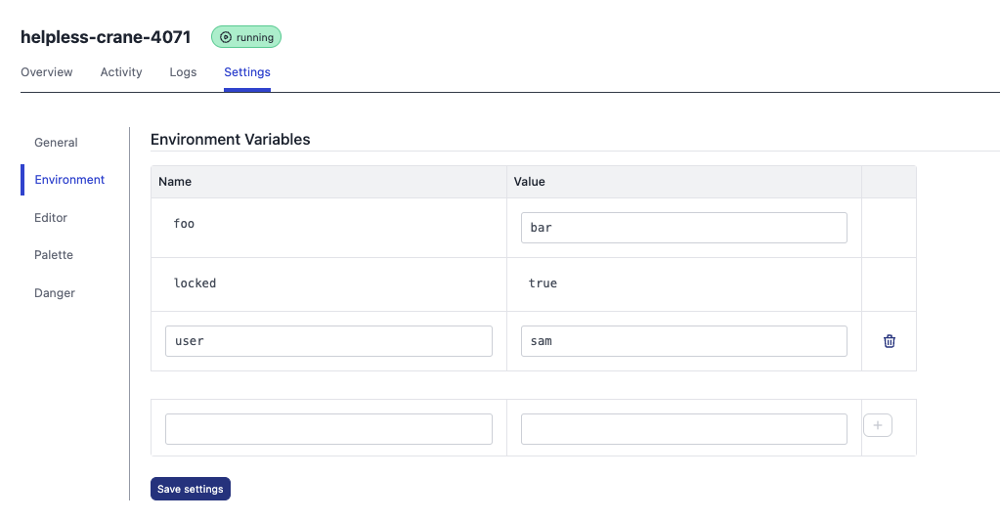

# Environment Variables

Environment Variables allow you to manage variables used in your Node-RED flows from the FlowForge application, you can read more on how to access environment variables inside Node-RED [in the Node-RED Docs](https://nodered.org/docs/user-guide/environment-variables)

An Environment Variable consists of a name and a value.

## Editing 

You can edit the environment variables for a project from the `Settings` tab of a project, select the `Environment` option from the side menu.

Changes will only take effect when the project is restarted.

## Template provided variables

The [Template](concepts.md#project-template) may include some predefined environment 
variables that are automatically applied to the project. The template may lock
some of those variables to prevent a Project from changing them.

Variables provided by the template cannot be deleted, however if they are editable,their value can be set to blank.

## Project

You can create additional variables for a single project by entering the name and value in the boxes at the bottom of the list and clicking the `+` button.

You can delete a project variable using the trash can icon.

The image below shows a project with 3 environment variables.

The first one `foo` is set by the template but the value `bar` is editable

The second one `locked` is set by the template and the value is set to `true` is not editable

The third one `user` is set for the project, the value can be edited or the variable deleted

