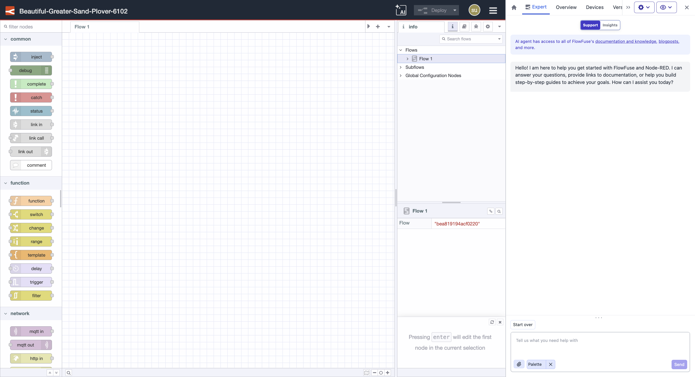
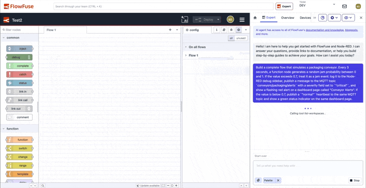
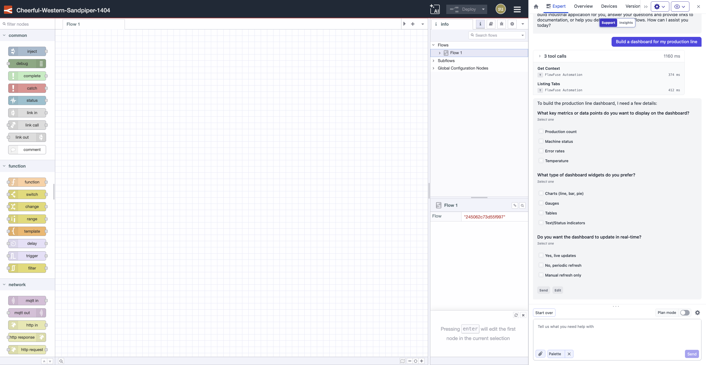
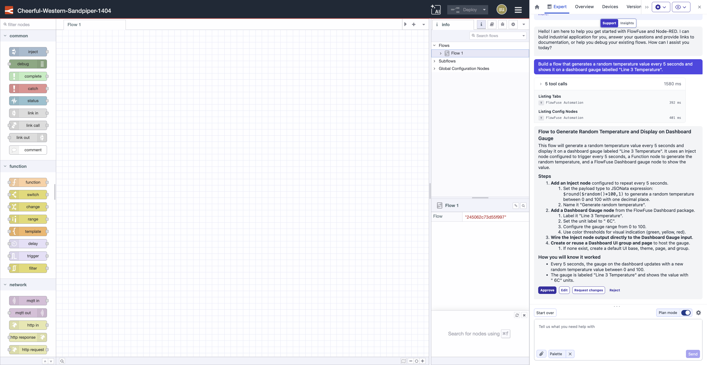
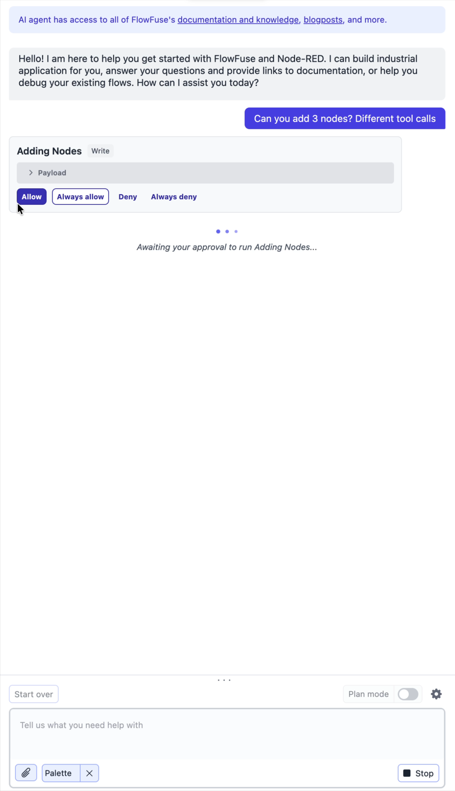
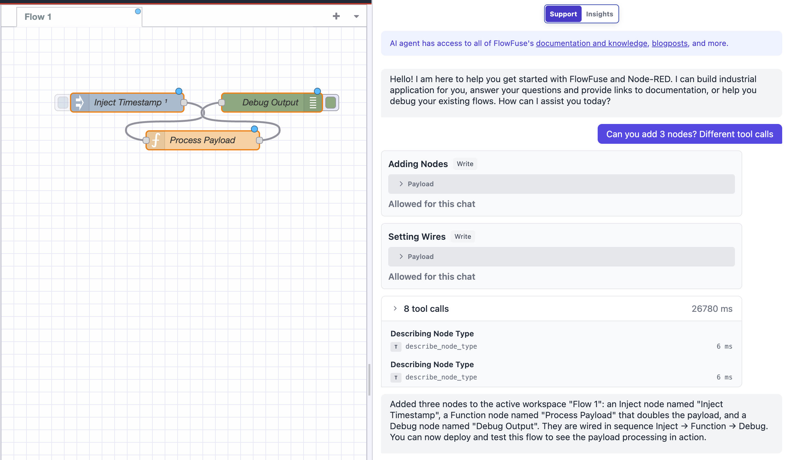
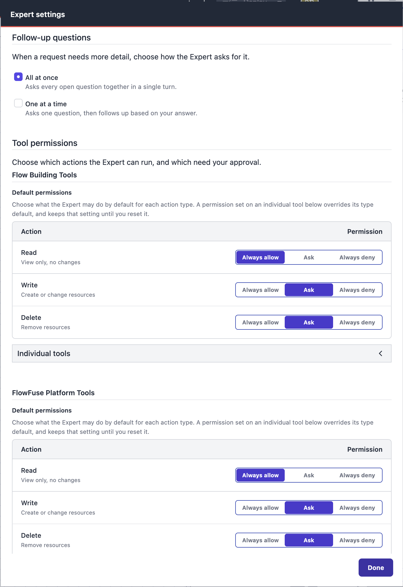
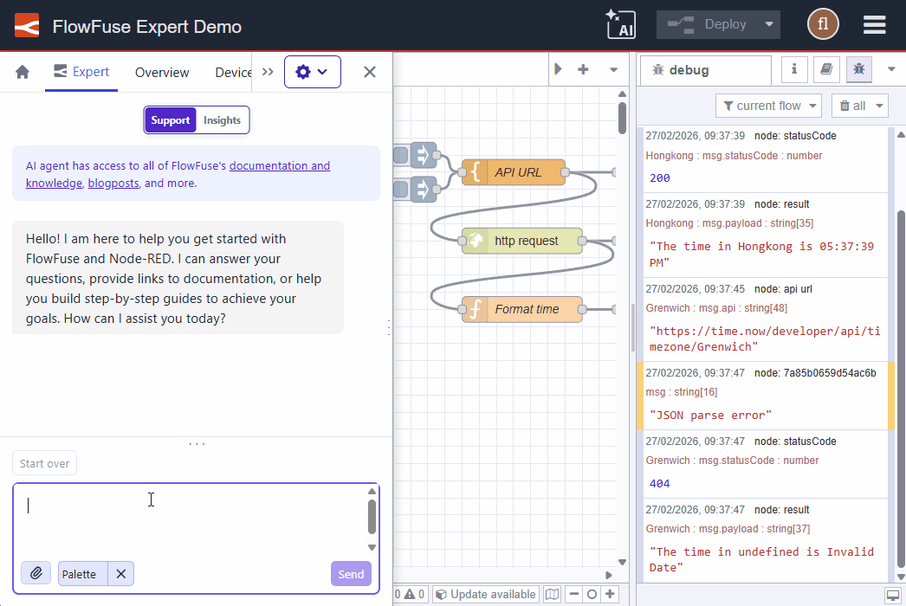
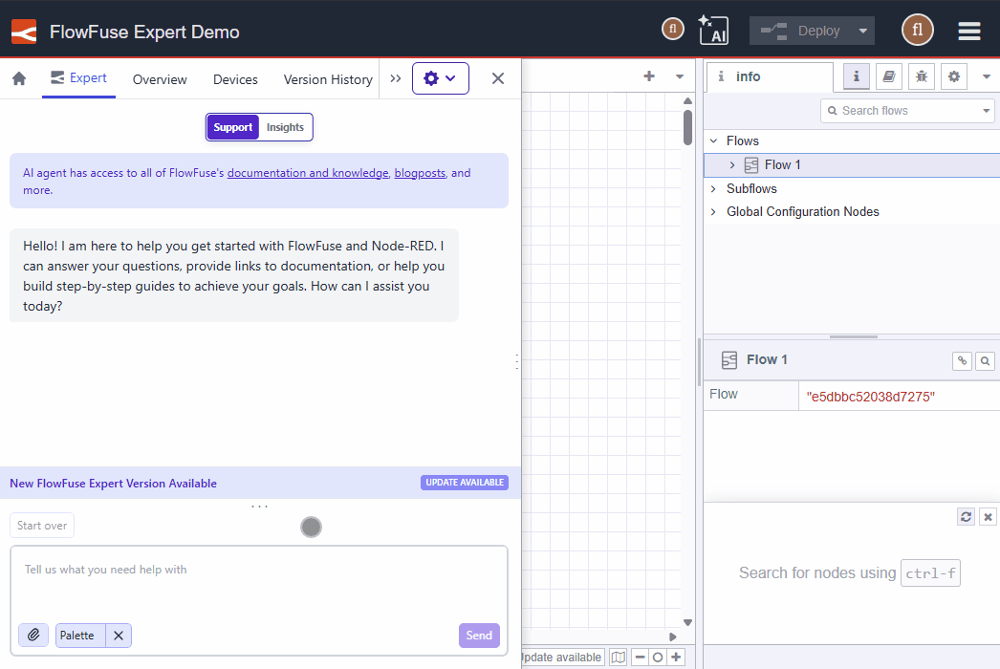

# Chat Interface

The FlowFuse Expert chat interface is where you actively engage the AI: asking questions, building flows directly on your canvas, and querying live operational data. While other FlowFuse Expert features (like inline code completions and next-node prediction) work passively in the Node-RED editor, the chat interface is where you direct Expert and see it act on your behalf.

> Team owners can disable all AI features, including the chat interface, from the team settings page. If AI has been disabled for your team, the Expert panel will not be available.

## Opening the Chat Interface

To open the chat, first open your Node-RED instance using the **Open Editor** button. This launches Immersive Mode, where the Expert panel is available alongside your canvas.

While in Immersive Mode you also have access to all [instance settings](/docs/user/instance-settings/) from a drawer that sits beside the canvas. You can manage environment variables, snapshots, the palette, and other settings without leaving the editor. Use the eye icon at the top of the drawer to move it left or right, pin or unpin it, or toggle fullscreen mode.

> **Note:** Note: As of v2.29, the FlowFuse Expert panel opens automatically whenever you enter the FlowFuse platform or an instance. If you close the panel, your preference is saved — Expert will remain closed on your next visit so it doesn’t get in your way. To open or close the panel while within the editor, click the FlowFuse drawer button in the top-left corner of the editor.

{data-zoomable}

## Chat Modes

The chat interface operates in two distinct modes. You can switch between them using the **Mode Selector** at the top of the Expert panel.

  <a class="assistant-feature" href="#support-mode">
    <svg width="48" height="48" viewBox="0 0 24 24" class="icon-stroke" xmlns="http://www.w3.org/2000/svg">
      <path d="M21 15a2 2 0 01-2 2H7l-4 4V5a2 2 0 012-2h14a2 2 0 012 2z" stroke-width="2"/>
      <path d="M8 9h8M8 13h6" stroke-width="1.5" stroke-linecap="round"/>
    </svg>
    <label style="margin: 10px 0; font-size: 16px; color: #333;">Support Mode</label>
  </a>

  <a class="assistant-feature" href="#insights-mode">
    <svg width="48" height="48" viewBox="0 0 24 24" class="icon-stroke" xmlns="http://www.w3.org/2000/svg">
      <circle cx="12" cy="12" r="3" stroke-width="2"/>
      <path d="M12 2v3M12 19v3M4.22 4.22l2.12 2.12M17.66 17.66l2.12 2.12M2 12h3M19 12h3M4.22 19.78l2.12-2.12M17.66 6.34l2.12-2.12" stroke-width="2" stroke-linecap="round"/>
    </svg>
    <label style="margin: 10px 0; font-size: 16px; color: #333;">Insights Mode</label>
  </a>

### Support Mode

**Support mode** is for flow-building assistance. Use it when you need help understanding, building, or debugging your Node-RED flows. Expert draws on its knowledge of Node-RED, your installed palette, and the context of your current flows to answer questions, explain and debug flows, and, when agentic flow building is enabled, build flows directly on your canvas.

Typical use cases in Support mode:
- "How do I convert data to CSV for writing to file & do you have any flow examples?"
- "Explain what this flow is doing"
- "Why is this node outputting a number instead of a string?"
- "Is `node-red-contrib-string` node installed on this instance?"
- "Build a flow that reads from Modbus and publishes each tag value to MQTT"

#### Building Flows on the Canvas

Expert can act on your requests directly by adding tabs, placing and wiring nodes, and configuring node properties on the canvas, rather than only describing what you should do yourself.

To use it, describe what you want to build in the chat input, the same way you would ask a question. Expert will start working immediately, and you can follow along via real-time status updates in the chat panel as each step completes. When it finishes, the result is live on your canvas. You can continue refining it through chat by asking Expert to adjust a configuration, add a node, or change a topic path, or you can edit the canvas directly as normal.

{data-zoomable}

Some prompts that work well:

- "Create a flow that reads Modbus registers from `192.168.1.10` every 5 seconds and publishes the values to MQTT on `factory/line3/temperature`"
- "Build an OEE dashboard tab with downtime reason buttons and a shift target gauge"
- "Add a shift handover screen that shows the last 5 alarms and a notes input field"
- "Set up a flow that polls an HTTP endpoint every minute and sends an alert if the response status is not 200"

The more specific your prompt, the closer the result will be to what you need. Include node names, topic paths, endpoints, or field names where you have them. Expert will use them directly rather than substituting placeholders.

> **Availability:** This feature is available on **FlowFuse Cloud** for all tiers, and from v2.32, to Self-Hosted Enterprise tiers. For Self-Hosted Enterprise tiers it requires a configuration for your instance. [Contact us](https://flowfuse.com/contact-us/?subject=FlowFuse%20Expert%20Application%20Building) to get access.

#### Staying in Control of What Expert Does

When Expert builds on your canvas, you stay in control of what it does and when. Three features let you steer it before and during a build: it can ask clarifying questions, propose a plan for your approval, and request permission before running individual actions.

> **Availability:** Clarifying questions, plan mode, and tool permissions are available to FlowFuse Cloud and self-hosted users from v2.32.

##### Clarifying Questions

Rather than guessing when a request is ambiguous, Expert can ask you a few questions before it starts. It presents up to four questions in a single turn, each as its own option group, either single-select or multi-select depending on the question. You answer all of them together and submit once, and Expert uses your answers to build exactly what you intended. You can edit an answered question and resubmit if you change your mind, up until you send a new message.

{data-zoomable}

You can control how often Expert asks from the **Follow-up questions** setting in the Expert settings dialog, choosing whether it asks all its questions **all at once** or **one at a time**.

##### Plan Mode

Plan mode lets you review Expert's approach before it changes anything on your canvas. Turn it on using the **plan mode** toggle in the composer. While it is enabled, Expert responds to your request with a proposed plan instead of acting on it.

The plan is shown as its own card with four actions:

- **Approve:** Expert exits plan mode and carries out the plan.
- **Edit:** the plan text is loaded into the composer so you can adjust it directly and resubmit.
- **Request changes:** describe what you'd like changed in your own words, and Expert proposes an updated plan.
- **Reject:** the plan is abandoned and nothing is built.

{data-zoomable}

Once you send a newer message, an earlier plan card is disabled so you can't act on a stale plan.

##### Controlling What Expert Can Do

You decide which actions Expert is allowed to take on your behalf, and which require your approval first. These cover both the flow-building actions Expert runs on your canvas and the platform actions it can take across FlowFuse outside the editor. Each action, such as reading a flow, writing nodes to the canvas, or creating an instance, carries an action type of **Read**, **Write**, or **Delete**, and each is governed by a permission.

**Approving actions in chat.** When an action is set to require approval, Expert pauses and shows an approval card in the chat before running it. The card shows the friendly name of the action, its type (Read / Write / Delete), and the exact parameters of the call as formatted JSON, so you can see precisely what Expert is about to do. You can then choose:

- **Allow:** run this action once.
- **Always allow:** run this action, and don't ask again for it for the rest of this chat.
- **Deny:** skip this action; Expert adapts and explains what it did instead.
- **Always deny:** skip it and don't ask again for it for the rest of this chat.

{data-zoomable}

Expert waits as long as you need, with no timeout on the decision. Stopping the chat while a card is open cancels the pending action (treated as a denial). "Always allow" and "Always deny" choices apply only to the current conversation and reset when you use **Start Over** or refresh. If you want to keep one, click **Make permanent** to save that choice for future chats.

Once you approve an action, the card collapses to show what was decided, and the build continues.

{data-zoomable}

**Configuring permissions in settings.** You can set your team's permissions ahead of time from the Expert settings dialog. To open it:

1. Open the FlowFuse Expert panel and select **Support** mode.
2. Click the settings (gear) icon at the top-right of the composer.

Permissions are saved **per team** and persist across your chats in that team, so each team can have its own policy. Switching to another team starts from the defaults again.

{data-zoomable}

For each action type you set a **default** for all Read actions, all Write actions, and all Delete actions, choosing between **Always allow**, **Ask**, and **Always deny**. You can then override individual actions where you want different behaviour; an override stays in place until you reset it. Each default shows how many actions are "set individually", with a **Reset** control to return those actions to the default.

The settings split actions into two groups: **Flow Building Tools**, the actions Expert takes on your canvas inside the editor, and **FlowFuse Platform Tools**, the actions it takes across the wider FlowFuse platform, such as listing your applications and instances, checking an instance's status or logs, and creating a new instance. Which group is shown first depends on where you are: flow-building tools lead inside the editor, and platform tools lead in the app. Flow-building tools only run inside an instance editor, so open one to let the Expert use them, though you can set their permissions here at any time.

**Role-based limits.** Permissions respect your team role. Read-only team members cannot enable or trigger actions that write or delete, and will see why they are unavailable. This is enforced by Expert itself, not just hidden in the interface.

**Example permission setups.** A few common ways to configure this:

- **Balanced (the default):** Read is set to *Always allow*, Write and Delete to *Ask*. Expert reads your flows freely and checks with you before changing or removing anything.
- **Fast building session:** set Write to *Always allow* so Expert builds without interrupting you, while leaving Delete on *Ask* so removals still need a nod. You can also grant a single tool *Always allow* from its approval card to skip repeat prompts for just that action for the rest of the chat.
- **Review-only / locked down:** set Delete to *Always deny* and Write to *Ask*, so Expert can propose and build step by step but can never remove anything.

For example, if you ask Expert to "add three nodes" with Write set to *Ask*, it pauses on the first *Adding Nodes* call and shows you the payload. Choose **Allow** to let just that call through, or **Always allow** so the remaining node additions in this chat don't prompt you again.

**Flow-building actions reference.** The flow-building actions available today, grouped by action type. New actions are added over time and some are gated to your instance's Expert version, so your list may differ slightly.

| Action type | What it covers | Actions |
|---|---|---|
| **Read** | View only, no changes | Describing Node Type, Describing Property, Getting Flow, Getting Nodes, Getting Palette, Listing Config Nodes, Listing Node Types, Listing Nodes, Listing Subflows, Listing Tabs, Searching Canvas, Selecting Nodes, Showing Workspace |
| **Write** | Create or change resources | Adding Nodes, Adding Subflow, Adding Tab, Arranging Nodes, Creating Subroutine, Managing Groups, Opening Palette Manager, Setting Links, Setting Wires, Updating Nodes, Updating Tab |
| **Delete** | Remove resources | Removing Nodes, Removing Tab |

**Platform actions reference.** The actions in the FlowFuse Platform Tools group, for working with your platform outside the editor. These are read and write only. There are no delete actions.

| Action type | What it covers | Actions |
|---|---|---|
| **Read** | View only, no changes | List Applications, Get Application, Get Application Hosted Instances, Get Application Remote Instances, Get Application Instances Status, Get Application Audit Log, List Teams, Get Team, Get Hosted Instance, Get Hosted Instance Status, Get Hosted Instance Logs, Check Hosted Instance Name Availability, List Team Remote Instances, Get Remote Instance, Get Remote Instance Status, List Hosted Instance Snapshots, List Remote Instance Snapshots, List Hosted Instance Types, List Stacks, List Templates, List Blueprints, Open Hosted Instance, Open Hosted Instance Editor |
| **Write** | Create or change resources | Create Application, Create Hosted Instance, Create Remote Instance, Assign Remote Instance To Application, Create Hosted Instance Snapshot, Create Remote Instance Snapshot |

#### Context: What the Expert Can See

Support mode becomes significantly more helpful when the Expert has context about your environment. Context is not automatic, you choose what to share with the Expert depending on what you need help with.

  <a class="assistant-feature" href="#palette-context">
    <svg width="48" height="48" viewBox="0 0 24 24" class="icon-stroke" xmlns="http://www.w3.org/2000/svg">
      <rect x="3" y="3" width="7" height="7" stroke-width="2" rx="1"/>
      <rect x="14" y="3" width="7" height="7" stroke-width="2" rx="1"/>
      <rect x="3" y="14" width="7" height="7" stroke-width="2" rx="1"/>
      <rect x="14" y="14" width="7" height="7" stroke-width="2" rx="1"/>
    </svg>
    <label style="margin: 10px 0; font-size: 16px; color: #333;">Palette Context</label>
  </a>

  <a class="assistant-feature" href="#flow-context">
    <svg width="48" height="48" viewBox="0 0 24 24" class="icon-stroke" xmlns="http://www.w3.org/2000/svg">
      <path d="M5 12h14M12 5l7 7-7 7" stroke-width="2" stroke-linecap="round" stroke-linejoin="round"/>
    </svg>
    <label style="margin: 10px 0; font-size: 16px; color: #333;">Flow Context</label>
  </a>

  <a class="assistant-feature" href="#debug-context">
    <svg width="48" height="48" viewBox="0 0 24 24" class="icon-stroke" xmlns="http://www.w3.org/2000/svg">
      <path d="M12 8v4l3 3" stroke-width="2" stroke-linecap="round"/>
      <circle cx="12" cy="12" r="9" stroke-width="2"/>
      <path d="M8 2l1.5 2M16 2l-1.5 2" stroke-width="1.5" stroke-linecap="round"/>
    </svg>
    <label style="margin: 10px 0; font-size: 16px; color: #333;">Debug Context</label>
  </a>

##### Palette Context

To add Palette Context, click the **Resource Selector** button (paperclip icon) in the chat interface and select **Palette**. Once added, the Expert has access to information about the nodes installed in your Node-RED instance - including installed packages and their versions.

This allows you to ask questions like:
- "Is my palette up to date?"
- "What version of node-red-dashboard is installed?"
- "Do I have a node available for reading from a PostgreSQL database?"

The Expert can use palette context to tailor its suggestions - for example, recommending nodes you actually have installed rather than suggesting ones that are not available.

{data-zoomable}

##### Flow Context

To add Flow Context, select the flow you want the Expert to reference from the flow tabs in the Node-RED editor. The selected flow is then added as context for the Expert to read and reason about.

This makes it possible to ask questions directly about your flows without having to copy and paste JSON or describe your configuration manually.

This allows you to ask questions like:
- "What does this flow do?"
- "Why does this flow output a number instead of a string?"
- "Is there something wrong with this flow? I don't seem to get an output from the debug node!"

Flow Context is what makes the Expert genuinely useful as a debugging and code review tool - it can see the same flow you're looking at and reason about it directly.

{data-zoomable}

##### Debug Context

To add Debug Context, you have 2 options:
1. Add individual log entries by clicking the ➕ button that appears over your debug message
2. Click the **Resource Selector** button (paperclip icon) in the chat interface and select **Add Debug Logs**. 

Once added, the Expert has access to the messages and output currently captured in your Node-RED debug panel.

This allows the Expert to reason directly about the data or errors you are getting from your nodes at runtime, not just the structure of the flow itself.

This allows you to ask questions like:
- "Why is this debug output a number instead of a string?"
- "What does this error message in the debug panel mean?"
- "Is the payload structure here what my downstream node expects?"

Debug Context is especially useful in combination with Flow Context - together they give the Expert both the structure of your flow and the actual data it is producing, making debugging significantly more effective.

{data-zoomable}

#### Resetting Context

If the Expert starts giving unexpected or inconsistent answers, it may be due to accumulated context from earlier in the conversation influencing its responses. Use the **Start Over** button to clear the conversation and start fresh with a clean context.

### Insights Mode

**Insights mode** connects the Expert to your live data via **Model Context Protocol (MCP)**. Use it when you want to query, analyze, or interact with real-world data - not just your Node-RED flows.

In Insights mode, you first select an MCP Server that you've built using [FlowFuse MCP Server Nodes](https://flowfuse.com/node-red/flowfuse/mcp/). The Expert can then use the tools and resources exposed by that server to answer questions against your live operational data. If you haven't built an MCP Server yet, see the guide on [building an MCP Server using FlowFuse](https://flowfuse.com/blog/2025/10/building-mcp-server-using-flowfuse/).

As of v2.32, Insights mode also reaches your **remote instances** at the edge, not just hosted instances. Point the Expert at a remote instance and ask about its live machine or operational data in plain language, with no dashboard to build and no query to write.

> **Note:** Insights on remote and self-hosted instances relies on a change to how data is routed through the platform in v2.32. Remote instances need Device Agent 4.0.0 or newer, and existing hosted instances on FlowFuse Cloud need to update to Launcher 2.23.0 or newer to keep working.

Typical use cases in Insights mode:
- You have an MCP Resource named `production_lines_facilities_list` that returns a list of your production lines, their facility names and the facility types (stamping, assembly, packaging etc)
    - You can ask: "List all stamping facilities on our production lines"
- You have added an MCP Tool named `get_production_live_state`
    -You can ask: "Tell me which of any of my assembly facilities are running and at what speed"
- You have added an MCP tool named `get_production_oee` that
    - You can ask: "Show me the worst 3 OEE results for all production line facilities"

> **Note:** Insights mode is currently in Beta. Capabilities are actively being expanded.

**To switch to Insights mode:**
1. Open the FlowFuse Expert panel
2. Use the **Mode Selector** to switch from "Chat" to "Insights"
3. Select the MCP Server you want to query
4. Ask your question

## Writing Better Queries

The quality of Expert's responses depends heavily on how your prompt is phrased, whether you are asking a question or requesting Expert to build something on the canvas. The more specific and contextual your prompt, the more accurate and actionable the result.

Here are some common patterns to improve your prompts:

### Be specific about what you're referring to

Vague references like "it", "this", or "that" require the Expert to guess what you mean. Name the thing explicitly.

| Less effective | More effective |
|---|---|
| "Is it up to date?" | "Is my palette up to date?" |
| "What does this mean?" | "What does this log entry mean?" |
| "Why did this happen?" | "Why did this error log occur?" |

### Describe the actual problem, not just a symptom

If something isn't behaving as expected, describe what you expected versus what you got.

| Less effective | More effective |
|---|---|
| "This doesn't work" | "My flow should output a string but it is outputting a number" |
| "The node is broken" | "The HTTP Request node is returning a 401 status code" |

### Include relevant details upfront

The Expert works best when it doesn't have to ask clarifying questions. Include relevant context - the node type, the message property, the protocol, or the error - in your initial query.

| Less effective | More effective |
|---|---|
| "How do I connect to a database?" | "How do I connect to a PostgreSQL database using the node-red-contrib-postgresql node?" |
| "How do I format this?" | "How do I format a Unix timestamp as an ISO 8601 string in a Function node?" |

### Ask one question at a time for complex topics

If you have multiple questions, consider asking them separately so the Expert can give a focused answer to each rather than a broad response that covers everything superficially.

*See also: [Node-RED Embedded AI](/docs/user/expert/node-red-embedded-ai/) for AI features built directly into the Node-RED editor.*

## Keeping Expert Up to Date

When a newer version of FlowFuse Expert is available, a banner appears in the chat area to let you know. You can update with a single click directly from the notification, without leaving your current workflow.

{data-zoomable}

