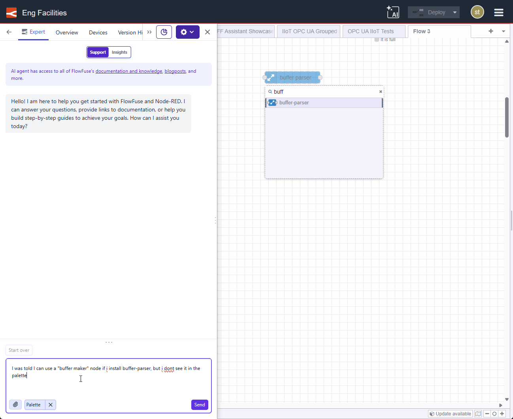
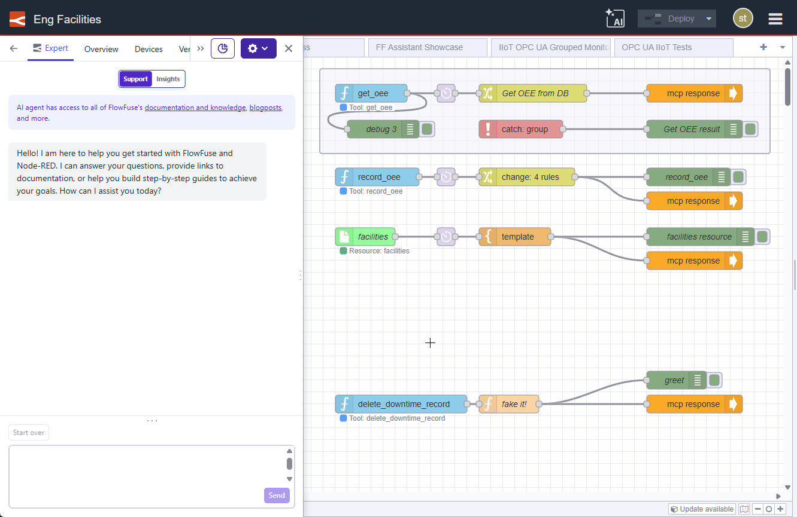

# Chat Interface

The FlowFuse Expert chat interface is your conversational AI companion that you can open directly in the Node-RED editor. While other FlowFuse Expert features (like inline code completions and next-node prediction) work passively in the Node-RED Editor, the chat interface is where you actively engage the AI - asking questions, exploring your flows, and gaining insights from your live data.

## Opening the Chat Interface

To open the chat, first open your Node-RED instance using the Open Editor button. This launches Immersive Mode.

## Chat Modes

The chat interface operates in two distinct modes. You can switch between them using the **Mode Selector** at the top of the Expert panel.

  <a class="assistant-feature" href="#support-mode">
    <svg width="48" height="48" viewBox="0 0 24 24" class="icon-stroke" xmlns="http://www.w3.org/2000/svg">
      <path d="M21 15a2 2 0 01-2 2H7l-4 4V5a2 2 0 012-2h14a2 2 0 012 2z" stroke-width="2"/>
      <path d="M8 9h8M8 13h6" stroke-width="1.5" stroke-linecap="round"/>
    </svg>
    <label style="margin: 10px 0; font-size: 16px; color: #333;">Support Mode</label>
  </a>

  <a class="assistant-feature" href="#insights-mode">
    <svg width="48" height="48" viewBox="0 0 24 24" class="icon-stroke" xmlns="http://www.w3.org/2000/svg">
      <circle cx="12" cy="12" r="3" stroke-width="2"/>
      <path d="M12 2v3M12 19v3M4.22 4.22l2.12 2.12M17.66 17.66l2.12 2.12M2 12h3M19 12h3M4.22 19.78l2.12-2.12M17.66 6.34l2.12-2.12" stroke-width="2" stroke-linecap="round"/>
    </svg>
    <label style="margin: 10px 0; font-size: 16px; color: #333;">Insights Mode</label>
  </a>

### Support Mode

**Support mode** is for flow-building assistance. Use it when you need help understanding, building, or debugging your Node-RED flows. In this mode, the Expert draws on its knowledge of Node-RED, your installed palette, and the context of your current flows to answer questions and provide guidance.

Typical use cases in Support mode:
- "How do I convert data to CSV for writing to file & do you have any flow examples?"
- "Explain what this flow is doing"
- "Why is this node outputting a number instead of a string?"
- "Is `node-red-contrib-string` node installed on this instance?"

#### Context: What the Expert Can See

Support mode becomes significantly more helpful when the Expert has context about your environment. Context is not automatic, you choose what to share with the Expert depending on what you need help with.

  <a class="assistant-feature" href="#palette-context">
    <svg width="48" height="48" viewBox="0 0 24 24" class="icon-stroke" xmlns="http://www.w3.org/2000/svg">
      <rect x="3" y="3" width="7" height="7" stroke-width="2" rx="1"/>
      <rect x="14" y="3" width="7" height="7" stroke-width="2" rx="1"/>
      <rect x="3" y="14" width="7" height="7" stroke-width="2" rx="1"/>
      <rect x="14" y="14" width="7" height="7" stroke-width="2" rx="1"/>
    </svg>
    <label style="margin: 10px 0; font-size: 16px; color: #333;">Palette Context</label>
  </a>

  <a class="assistant-feature" href="#flow-context">
    <svg width="48" height="48" viewBox="0 0 24 24" class="icon-stroke" xmlns="http://www.w3.org/2000/svg">
      <path d="M5 12h14M12 5l7 7-7 7" stroke-width="2" stroke-linecap="round" stroke-linejoin="round"/>
    </svg>
    <label style="margin: 10px 0; font-size: 16px; color: #333;">Flow Context</label>
  </a>

##### Palette Context

To add Palette Context, click the **upload icon** (pin icon) in the chat interface and select **Palette**. Once added, the Expert has access to information about the nodes installed in your Node-RED instance - including installed packages and their versions.

This allows you to ask questions like:
- "Is my palette up to date?"
- "What version of node-red-dashboard is installed?"
- "Do I have a node available for reading from a PostgreSQL database?"

The Expert can use palette context to tailor its suggestions - for example, recommending nodes you actually have installed rather than suggesting ones that are not available.

{data-zoomable}

##### Flow Context

To add Flow Context, select the flow you want the Expert to reference from the flow tabs in the Node-RED editor. The selected flow is then added as context for the Expert to read and reason about.

This makes it possible to ask questions directly about your flows without having to copy and paste JSON or describe your configuration manually.

This allows you to ask questions like:
- "What does this flow do?"
- "Why does this flow output a number instead of a string?"
- "Is there anything in this flow that could cause message loss?"

Flow Context is what makes the Expert genuinely useful as a debugging and code review tool - it can see the same flow you're looking at and reason about it directly.

{data-zoomable}

### Insights Mode

**Insights mode** connects the Expert to your live data via **Model Context Protocol (MCP)**. Use it when you want to query, analyze, or interact with real-world data - not just your Node-RED flows.

In Insights mode, you first select an MCP Server that you've built using [FlowFuse MCP Server Nodes](https://flowfuse.com/node-red/flowfuse/mcp/). The Expert can then use the tools and resources exposed by that server to answer questions against your live operational data. If you haven't built an MCP Server yet, see the guide on [building an MCP Server using FlowFuse](https://flowfuse.com/blog/2025/10/building-mcp-server-using-flowfuse/).

Typical use cases in Insights mode:
- "What is the current status of production line 3?"
- "Query the database and show me the last 10 error events"
- "Summarize today's sensor readings from the MQTT broker"

> **Note:** Insights mode is currently in Beta. Capabilities are actively being expanded.

**To switch to Insights mode:**
1. Open the FlowFuse Expert panel
2. Use the **Mode Selector** to switch from "Chat" to "Insights"
3. Select the MCP Server you want to query
4. Ask your question

## Writing Better Queries

The quality of the Expert's responses depends heavily on how your questions are phrased. The more specific and contextual your query, the more accurate and actionable the answer.

Here are some common patterns to improve your queries:

### Be specific about what you're referring to

Vague references like "it", "this", or "that" require the Expert to guess what you mean. Name the thing explicitly.

| Less effective | More effective |
|---|---|
| "Is it up to date?" | "Is my palette up to date?" |
| "What does this mean?" | "What does this log entry mean?" |
| "Why did this happen?" | "Why did this error log occur?" |

### Describe the actual problem, not just a symptom

If something isn't behaving as expected, describe what you expected versus what you got.

| Less effective | More effective |
|---|---|
| "This doesn't work" | "My flow should output a string but it is outputting a number" |
| "The node is broken" | "The HTTP Request node is returning a 401 status code" |

### Include relevant details upfront

The Expert works best when it doesn't have to ask clarifying questions. Include relevant context - the node type, the message property, the protocol, or the error - in your initial query.

| Less effective | More effective |
|---|---|
| "How do I connect to a database?" | "How do I connect to a PostgreSQL database using the node-red-contrib-postgresql node?" |
| "How do I format this?" | "How do I format a Unix timestamp as an ISO 8601 string in a Function node?" |

### Ask one question at a time for complex topics

If you have multiple questions, consider asking them separately so the Expert can give a focused answer to each rather than a broad response that covers everything superficially.

*See also: [Node-RED Embedded AI](/docs/user/expert/node-red-embedded-ai/) for AI features built directly into the Node-RED editor.*

