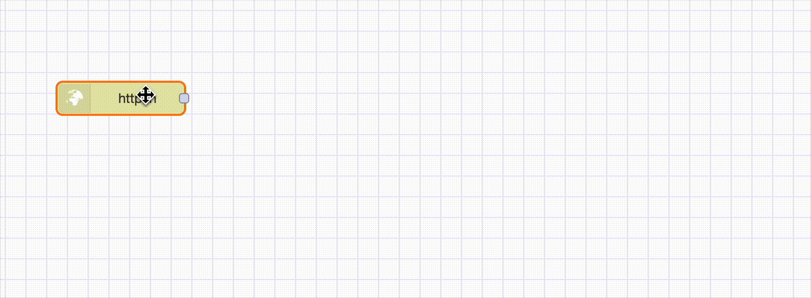
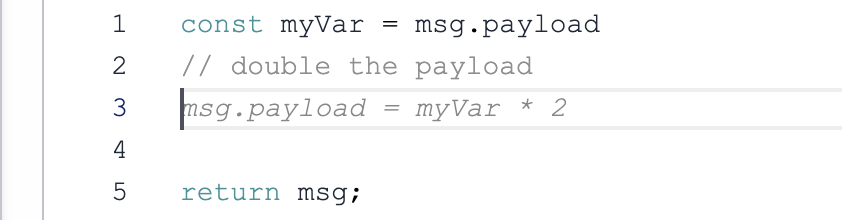
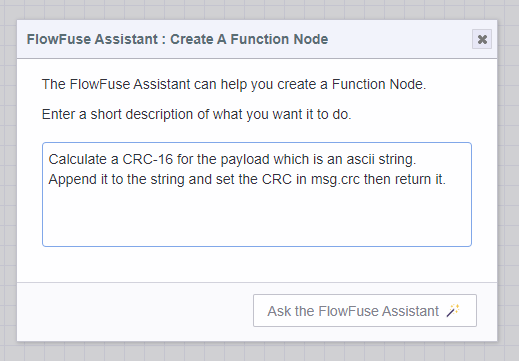
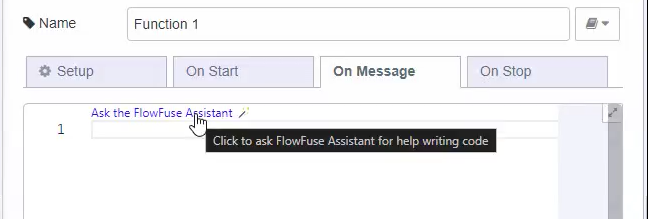
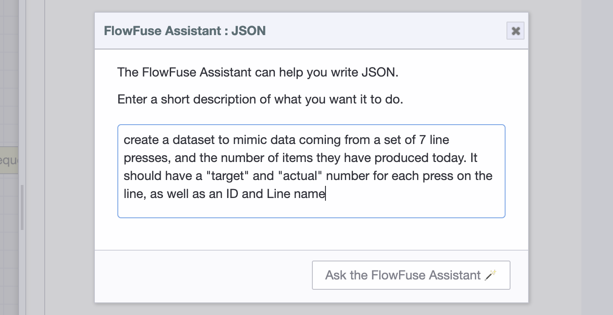
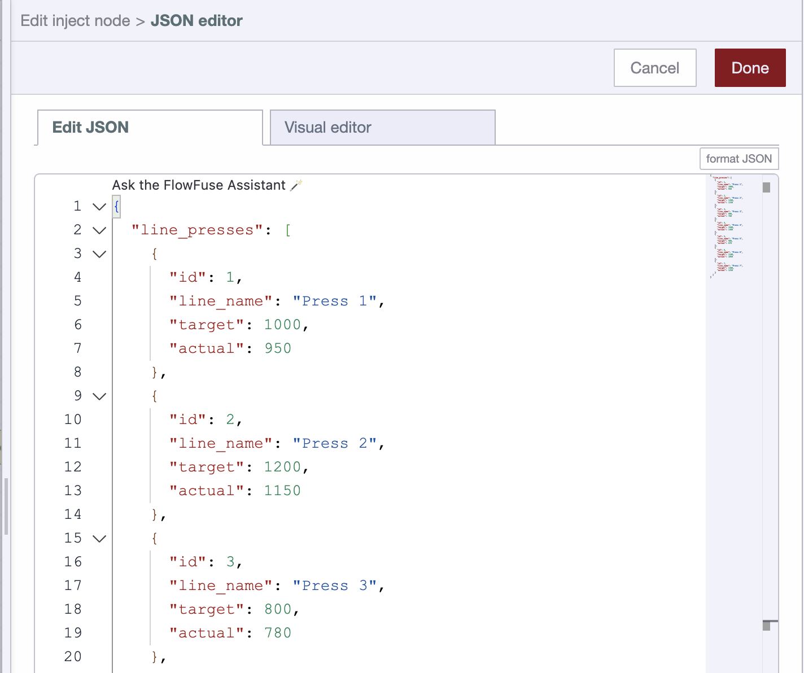

# AI in Node-RED

FlowFuse Expert brings AI assistance directly into the Node-RED editor itself. Unlike the [Chat Interface](/docs/user/expert/chat/), which is a conversational panel you open separately, FlowFuse Expert's in-editor AI works where you already are - inside node editors, on the canvas, and in the palette.

> **Note:** FlowFuse Expert can also be installed as a plugin into Node-RED instances running outside of FlowFuse, using the `@flowfuse/nr-assistant` package from the Node-RED Palette Manager. This requires a FlowFuse Cloud account but does not require a paid subscription for the current release.

To enable the latest features, ensure your instance is running the latest Stack. **For FlowFuse Cloud instances, FlowFuse Expert (`@flowfuse/nr-assistant`) is automatically updated to the latest version.**

## Features

  <a class="assistant-feature" href="#flow-autocomplete">
    <svg width="48" height="48" viewBox="0 0 24 24" class="icon-stroke" xmlns="http://www.w3.org/2000/svg">
      <path d="M3 12c0-2 1-4 3-4s3 2 3 4" stroke-width="2" stroke-linecap="round"/>
      <path d="M9 12c0 2 1 4 3 4s3-2 3-4" stroke-width="2" stroke-linecap="round"/>
    </svg>
    <label style="margin: 10px 0; font-size: 16px; color: #333;">Flow Autocomplete</label>
  </a>
  
  <a class="assistant-feature" href="#inline-code-completions">
    <svg width="48" height="48" viewBox="0 0 24 24" class="icon-stroke" xmlns="http://www.w3.org/2000/svg">
      <path d="M6 7h6M6 11h6M6 15h12" stroke-width="1.5" stroke-linecap="round"/>
      <path d="M16 7l2 2-2 2" stroke-width="2" stroke-linecap="round" stroke-linejoin="round"/>
    </svg>
    <label style="margin: 10px 0; font-size: 16px; color: #333;">Inline Code Completions</label>
  </a>

  <a class="assistant-feature" href="#flow-explainer">
    <svg width="48" height="48" viewBox="0 0 24 24" class="icon-stroke" xmlns="http://www.w3.org/2000/svg">
      <path d="M21 15a2 2 0 01-2 2H7l-4 4V5a2 2 0 012-2h14a2 2 0 012 2z" stroke-width="2"/>
      <path d="M8 9h8M8 13h6" stroke-width="1.5" stroke-linecap="round"/>
    </svg>
    <label style="margin: 10px 0; font-size: 16px; color: #333;">Flow Explainer</label>
  </a>

  <a class="assistant-feature" href="#function-node-creation">
    <svg width="48" height="48" viewBox="0 0 54 54" class="icon-fill">
      <path xmlns="http://www.w3.org/2000/svg" d="M30.999 31.005v-3h-6.762s.812-12.397 1.162-14 .597-3.35 2.628-3.103 1.971 3.103 1.971 3.103l4.862-.016s-.783-3.984-2.783-5.984-7.946-1.7-9.633.03c-1.687 1.73-2.302 5.065-2.597 6.422-.588 4.5-.854 9.027-1.248 13.547h-8.6v3H18.1s-.812 12.398-1.162 14-.597 3.35-2.628 3.103-1.972-3.102-1.972-3.102l-4.862.015s.783 3.985 2.783 5.985c2 2 7.946 1.699 9.634-.031 1.687-1.73 2.302-5.065 2.597-6.422.587-4.5.854-9.027 1.248-13.547z" />
    </svg>
    <label style="margin: 10px 0; font-size: 16px; color: #333;">Function Builder</label>
  </a>
  
  <a class="assistant-feature" href="#function-code-generation">
    <svg width="48" height="48" viewBox="0 0 24 24" class="icon-fill" xmlns="http://www.w3.org/2000/svg">
      <path d="M13 2L3 14h9l-1 8 10-12h-9l1-8z" fill="#2563eb"/>
    </svg>
    <label style="margin: 10px 0; font-size: 16px; color: #333;">Function Code Generation</label>
  </a>
  
  <a class="assistant-feature" href="#json-generation">
    <svg width="48" height="48" viewBox="0 0 24 24" class="icon-stroke" xmlns="http://www.w3.org/2000/svg">
      <path d="M14 2H6a2 2 0 00-2 2v16a2 2 0 002 2h12a2 2 0 002-2V8z" stroke-width="2"/>
      <polyline points="14,2 14,8 20,8" stroke="#2563eb" stroke-width="2"/>
      <path d="M8 13h8M8 17h4" stroke="#2563eb" stroke-width="2" stroke-linecap="round"/>
    </svg>
    <label style="margin: 10px 0; font-size: 16px; color: #333;">JSON Generation</label>
  </a>  
  
  <a class="assistant-feature" href="#css-and-html-generation-for-flowfuse-dashboard">
    <svg width="48" height="48" viewBox="0 0 24 24" fill="none" xmlns="http://www.w3.org/2000/svg">
      <path d="M21 16V8a2 2 0 00-1-1.73l-7-4a2 2 0 00-2 0l-7 4A2 2 0 003 8v8a2 2 0 001 1.73l7 4a2 2 0 002 0l7-4A2 2 0 0021 16z" stroke="#2563eb" stroke-width="2"/>
      <polyline points="3.29,7 12,12 20.71,7" stroke="#2563eb" stroke-width="2"/>
      <line x1="12" y1="22" x2="12" y2="12" stroke="#2563eb" stroke-width="2"/>
      <path d="M8 10l4-2 4 2" stroke="#2563eb" stroke-width="1"/>
    </svg>
    <label style="margin: 10px 0; font-size: 16px; color: #333;">CSS & HTML Generation</label>
  </a>

1. **Flow Autocomplete:** Automated, intelligent suggestions for which node should be added next in your flow
2. **Inline Code Completions:** Inline code completions for Function node, Tables Query node and FlowFuse Dashboard `ui-template` node
3. **Flow Explainer:** Get detailed explanations of the selected nodes in your flow
4. **Function Node Creation:** Create a new function node directly, driven by natural language
5. **Function Code Generation:** Within the scope of an existing function node, ask the assistant to write code for you
6. **JSON Generation:** In-editor JSON generation within the JSON editor for all typed inputs and JSON editors
7. **CSS and HTML Generation:** In-editor CSS and HTML generation for FlowFuse Dashboard `ui-template` nodes

### Flow Autocomplete

{data-zoomable width="700px"}
_Recording of the flow autocomplete in-action, with up/down keys used to toggle suggestions and tab to move to the next suggestion_

FlowFuse Expert runs a trained, in-browser machine learning model that provides intelligent suggestions for which node should be added next in your flow.

You can accept the suggestion by clicking it or by pressing the `Tab` key. You can also toggle through suggestions by pressing the `Up` and `Down` keys.

### Inline Code Completions

Mimicking the familiar code assistant in your IDE, FlowFuse Expert provides inline code completions for Function nodes, Tables Query nodes, and FlowFuse Dashboard `ui-template` nodes.

{data-zoomable width="450px"}
_A simple example of inline code completions for a Function node_

This feature accelerates the writing of custom code and queries by providing intelligent suggestions without having to leave the editor, lowering the barrier to entry for non-technical users.

Using comments is optional - the assistant will do its best to understand the context of the code and provide suggestions based on the surrounding code. However, writing comments does help to frame the request in a way that is more likely to produce accurate results.

### Flow Explainer

FlowFuse Expert adds a button to the Assistant menu that will explain what the selected nodes do. To use this feature, select one or more nodes on the canvas and click the "Explain Flows" button in the Assistant menu.

### Function Node Creation

_Screenshot showing the FlowFuse Expert dialog for creating a function node_

Use natural language to request a new function node be added to your Node-RED flow. This is useful when you want to quickly add a function node without having to drag it from the palette and write the code yourself.

If your instance supports external modules, you can ask for a function node that uses them and they will be added to the function node setup automatically. If your function node requires multiple outputs, FlowFuse Expert will set the correct number of outputs accordingly.

### Function Code Generation

FlowFuse Expert adds a code lens to the function node editor that allows you to generate code directly within the editor.

{data-zoomable}

This is useful when you want to quickly add or rewrite code within an existing function node without generating a full new function node from scratch.

### JSON Generation

FlowFuse Expert adds a code lens to the JSON editor that allows you to generate JSON directly within the Monaco editor.

{data-zoomable width="700px"}
_Screenshot showing a FlowFuse Expert prompt for JSON generation_

This is useful when you want to quickly generate JSON for a prototype or to test a piece of functionality in your flows.

{data-zoomable width="700px"}
_Screenshot showing the result of the above FlowFuse Expert prompt_

### CSS and HTML Generation for FlowFuse Dashboard

FlowFuse Expert adds a code lens to the FlowFuse Dashboard `ui-template` node that allows you to generate CSS and HTML directly within the code editor. It is aware of the context of the node and will generate suitable CSS and HTML components for Vuetify and the FlowFuse Dashboard.

## Installing in External Node-RED Instances

> **Note:** FlowFuse Cloud instances have FlowFuse Expert automatically installed. Manual installation is only needed for Node-RED instances running outside of FlowFuse. Only the in-editor AI features can be installed externally - the Chat Interface is exclusive to FlowFuse.

To install the plugin in your own Node-RED instance:

1. Use the Node-RED Palette Manager to install the package `@flowfuse/nr-assistant`
2. Restart Node-RED
3. Click the FlowFuse Expert icon in the header
4. Follow the prompts to connect to your FlowFuse Cloud account
5. Once connected, you will be able to use all FlowFuse Expert features

### FlowFuse Expert for self-hosted customers

If you are self-hosting FlowFuse with an Enterprise license, get in touch with [support](/support) who will be able to help get you set up to use FlowFuse Expert locally.

