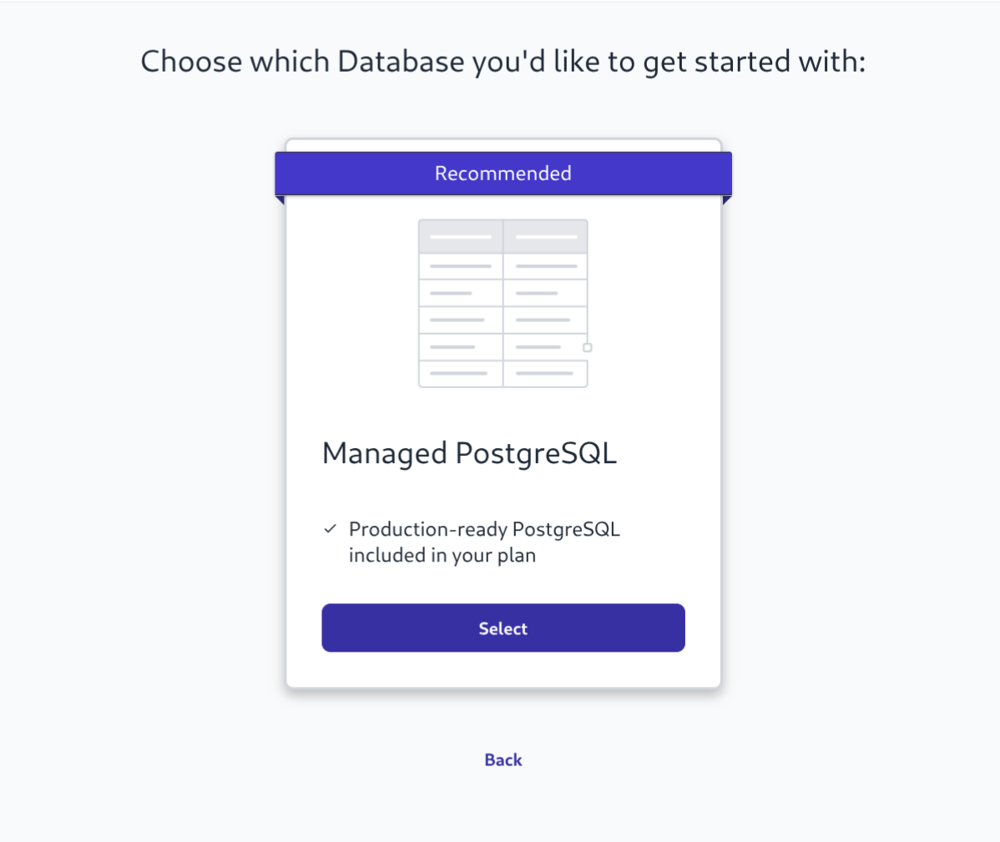
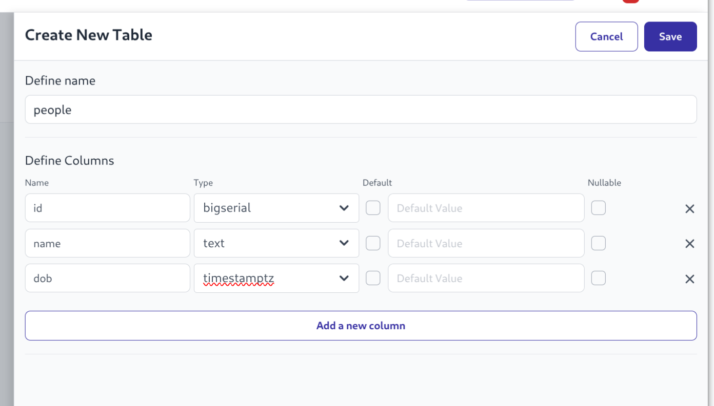
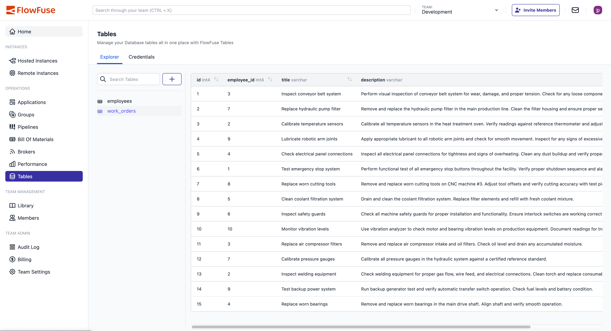
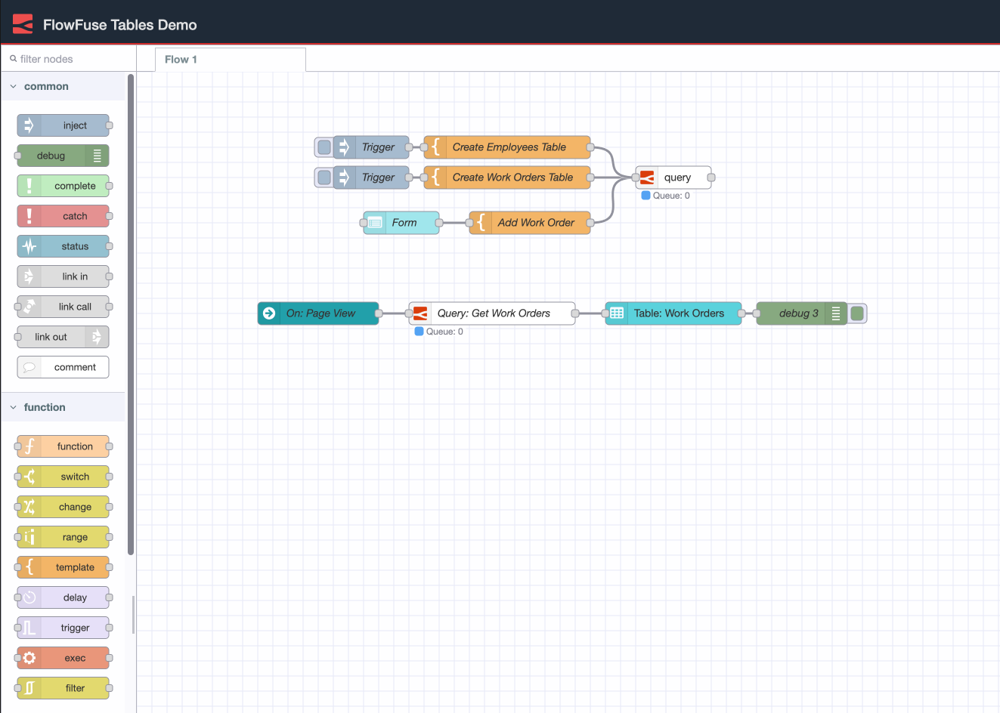
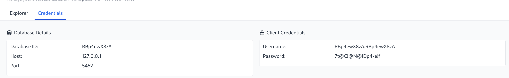

# FlowFuse Tables

  This feature is currently in <a href="https://flowfuse.com/handbook/engineering/releases/#beta-release">the beta state</a>

From FlowFuse v2.20.0 Teams (Enterprise teams only) can create a relational database to use to store data.

You can create a database by selecting the Tables entry in the left hand menu

{data-zoomable}
_Screenshot of FF Tables create database menu_

Once you have created a database you can use the wizard to create some tables. The wizard offers a subset of the most used column types and has the option to set default values and generate sequences for ids.

{data-zoomable}
_Screenshot of create tables wizard_

Once the tables have data in them then the first 10 rows will be displayed in the Explorer tab.

{data-zoomable}
_Screenshot of Tables Explorer_

## Query Nodes

FlowFuse Node-RED instances come with a Query Node that will be enabled if running in a Team with a FlowFuse Tables database enabled. This node will automatically import the required credentials to connect to the database.

{data-zoomable}
_Screenshot of Node-RED query node_

## Postgres Clients

You can connect any Postgres Client to the FlowFuse Tables database using the information on the Credentials tab

{data-zoomable}
_Screenshot of credentials_
