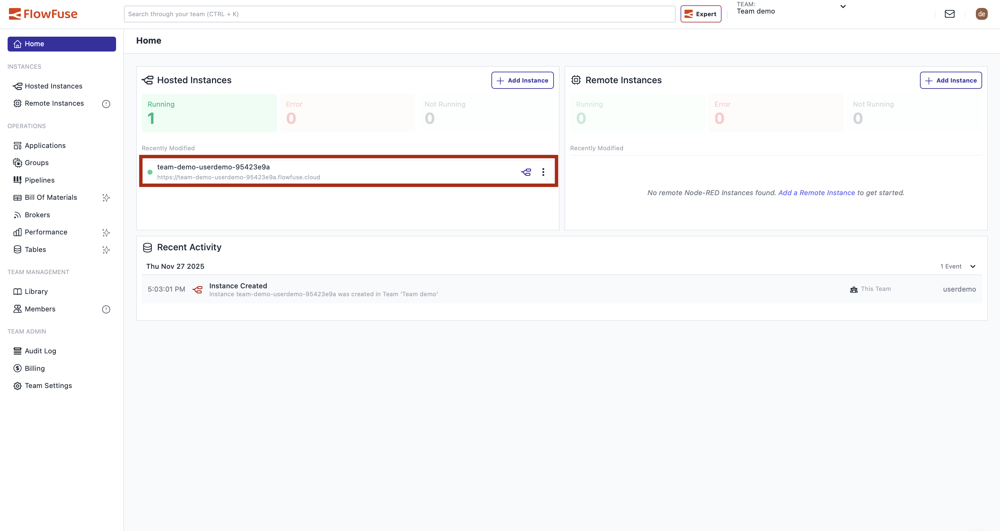
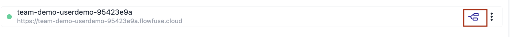
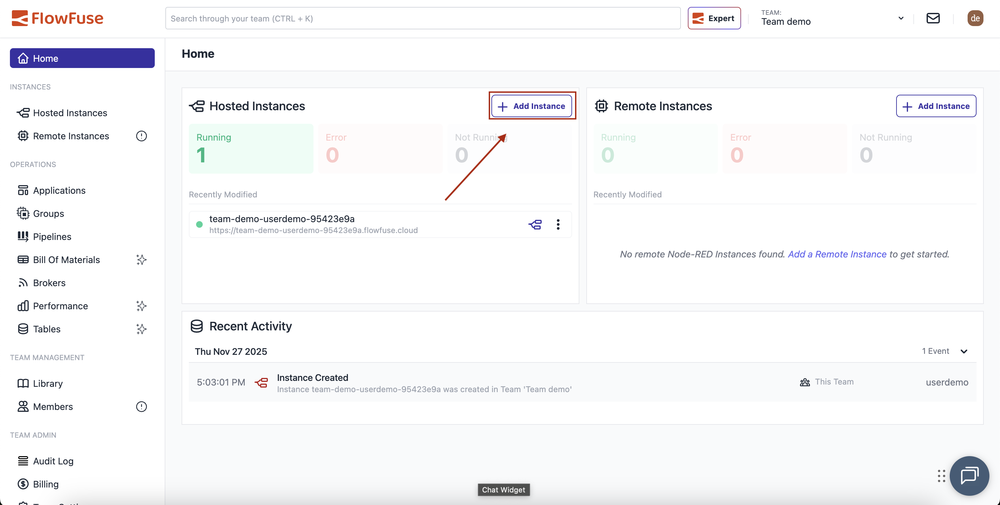
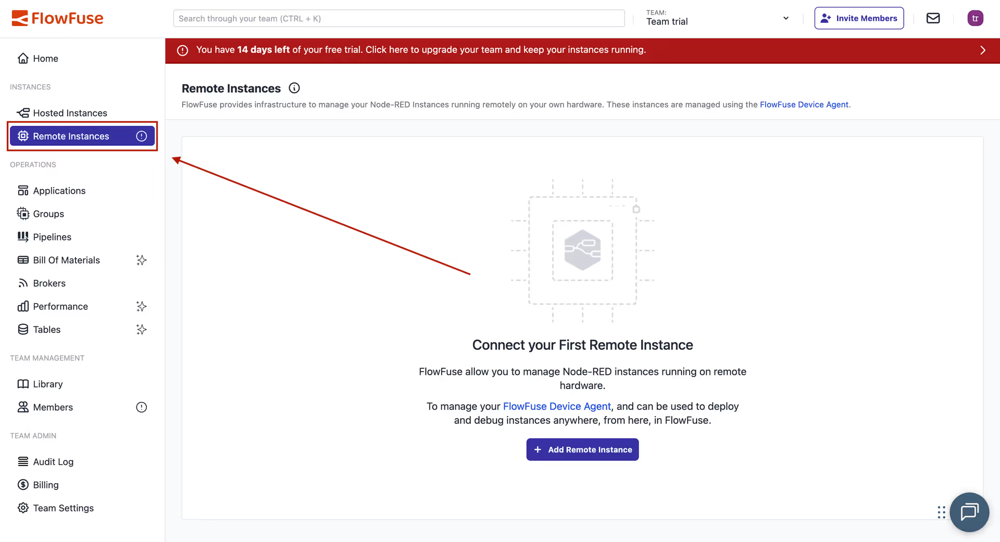
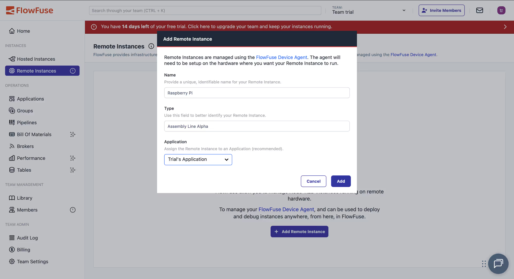
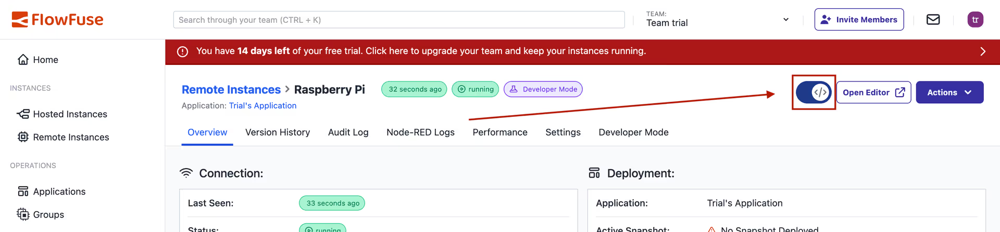
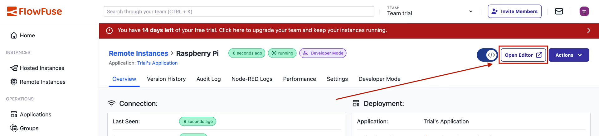
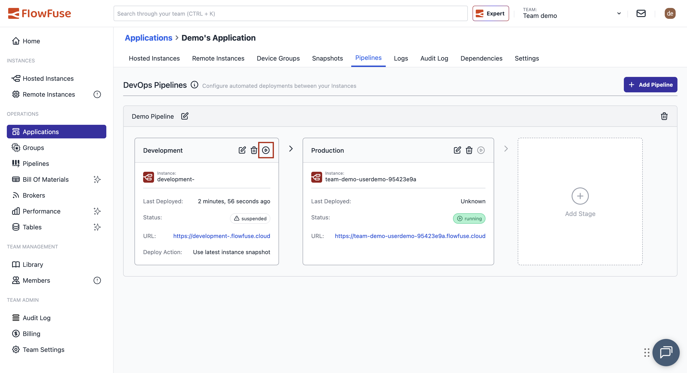

# Getting Started with FlowFuse

This guide will help you learn how to use the FlowFuse platform to quickly create new Node-RED applications after a successful [installation](/docs/install/introduction.md) or [sign-up](https://app.flowforge.com/account/create) for FlowFuse Cloud.

## Creating a Node-RED Instance

### Your First Hosted Instance

Your first Node-RED instance should be automatically created upon your initial login to FlowFuse.

{data-zoomable}

**Accessing the Node-RED Editor:**

To access the Node-RED Editor, simply click on the option shown in the image below marked with a red box:

{data-zoomable}

Alternatively, you can click on that instance and then you will find the "Open Editor" button at the top right:

{data-zoomable}

### Creating Additional Instances

For utilizing various other FlowFuse features (e.g., DevOps Pipelines), it's highly beneficial to create a second Node-RED instance. A second Node-RED instance is included in both our Starter Tier and the Trial Phase of FlowFuse Cloud.

**From the Home Page:**

1. Click on the "Add Instance" button shown in the image below
2. Enter the name you want for your instance
3. Select your application in which you want to create it
4. Select the instance type
5. Select the Node-RED version from the dropdown
6. Click "Next" and [select the blueprint](#selecting-a-blueprint) you want to use

{data-zoomable}

**From the Applications Page:**

Alternatively, you can go to your applications from the left sidebar by clicking "Applications," select your application—in our example, "Demo's Application"—and click "Add Instance," then follow the same process.

[Learn more about Instances](#working-with-instances)

### Your First Remote Instance

A remote instance allows you to run Node-RED on your own hardware while managing it through FlowFuse.

**Adding a Remote Instance:**

1. Click on "Remote Instances" from the left sidebar
2. Click "Add Remote Instance"
3. Enter a name for your instance and select the device type
4. Select your application and click "Add"

{data-zoomable}

{data-zoomable}

**Installing the Device Agent:**

FlowFuse will show you a device configuration window with installation options:

- **One-Line Install** (Recommended): Automatically installs Node.js (if needed), the device agent, and registers your device
- **NPM Installation**: Manual installation instructions for Windows, Mac, or Linux

{data-zoomable}

Follow the steps in the window to connect your device—it takes less than a minute.

[Learn more about Device Agent](./docs/device-agent/)

**Accessing Your Remote Instance:**

Once registered, you can manage your remote Node-RED instance through FlowFuse:

To start building flows:

1. Enable "Developer Mode" from the top right
2. Click "Open Editor"

{data-zoomable}

{data-zoomable}

### Selecting a Blueprint

When creating a new Node-RED instance, you have the option to choose a blueprint tailored for specific use cases. For example, our "ANDON Operator Terminal" blueprint can be selected, and it will automatically configure the Node-RED instance, install necessary nodes, sparing you the need to start from scratch. Click "Create Instance" from the top-right to complete the process.

While these templates are powerful out-of-the-box, they're also fully customizable, allowing you to tweak them to suit your unique requirements. Ultimately, blueprints speed up the learning curve for new users and expedite the solution-building process for experienced ones.

{data-zoomable}

**NOTE**: _Some blueprints may only be available on certain tiers_

## Creating Your First Flow

FlowFuse published an [eBook on Node-RED development](https://flowfuse.com/ebooks/beginner-guide-to-a-professional-nodered/), which is a great resources when you're new
to Node-RED. You can also read our [blog post on creating your first flow](https://flowfuse.com/blog/2023/01/getting-started-with-node-red/).

## Creating Your First DevOps Pipeline

DevOps Pipelines enable you to link multiple Node-RED instances together in a deployment pipeline.

1. **Add a Pipeline**: Select your application and click `Add Pipeline`.

    

2. **Name Your Pipeline**: Enter a suitable name.

3. **Add Stages**: You can now add stages to your pipeline. In our example, we add a Development Stage and a Production Stage.

4. **Execute the Pipeline**: It is now easy to execute the pipeline with one click, promoting your recently created flow to your Production Node-RED instance.

    

[Learn more about DevOps Pipelines](/docs/user/devops-pipelines/)

## Working with Devices 

FlowFuse supports managing Node-RED on your own hardware.

 - [Getting started with Devices](/docs/device-agent/introduction.md)

## Working with Teams

 - [Team management](/docs/user/team/README.md) - How to add and remove users from a team.
 - [Role based access control](/docs/user/team/README.md#role-based-access-control) - Which privileges are granted to different roles.

## Working with Files and Context

FlowFuse supports reading and writing persistent files and persistent context.

 - [Working with Files](/docs/user/filenodes.md)
 - [Working with the Static Asset Service](/docs/user/static-asset-service.md)
 - [Working with Context](/docs/user/persistent-context.md)

 ## Working with Instances

 - [Snapshots](/docs/user/snapshots.md) - Create point-in-time backups of your Node-RED instances.
 - [Environment Variables](/docs/user/envvar.md) - How to manage Environment Variables in your Node-RED instances.
 - [Change Project Stack](/docs/user/changestack.md) - How to change an instance stack, for example to upgrade Node-RED.
 - [Logs](/docs/user/logs.md) - The Logs available in the FlowFuse application.
 - [Project Link Nodes](/docs/user/projectnodes.md) - Custom nodes for sending messages between Node-RED instances and devices.
 - [MQTT Nodes](/docs/user/mqtt-nodes.md) - Custom nodes for zero config MQTT integration with the team broker.
 - [Instance Settings](/docs/user/instance-settings.md) - Settings available for Node-RED instances.
 - [Shared Team Library](/docs/user/shared-library.md) - Share flows easily between different Node-RED instances in your team.
 - [Node-RED Tools Plugin](/docs/migration/node-red-tools.md) - A plugin for Node-RED that lets you work with your flows outside of FlowFuse.
 - [High Availability mode](/docs/user/high-availability.md) - Run multiple copies of your instance for scaling and availability.
 - [FlowFuse Assistant](/docs/user/assistant.md) - A plugin for Node-RED that helps you code faster.
 
 ## Working with MQTT

 - [Team Broker](/docs/user/teambroker.md) - Working with the FlowFuse bundled MQTT Broker

## Working with Custom Nodes

 - [Custom Nodes](/docs/user/custom-npm-packages.md) - Publishing Custom Node-RED Nodes

 ## Working with FF Tables

  - [FF Tables](/docs/user/ff-tables.md) - Databases