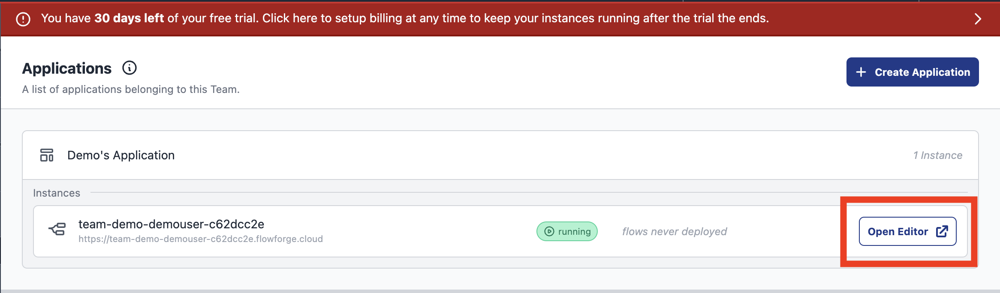
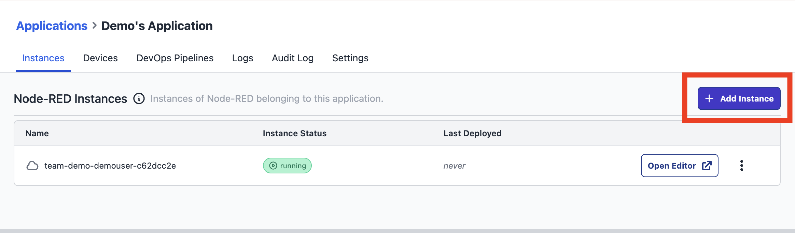
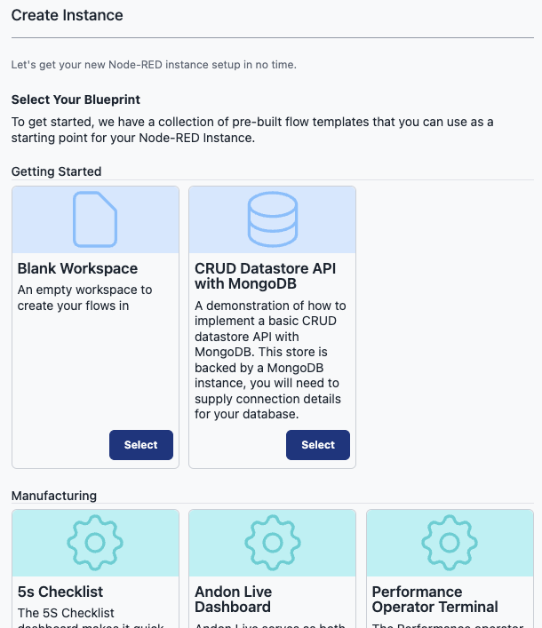
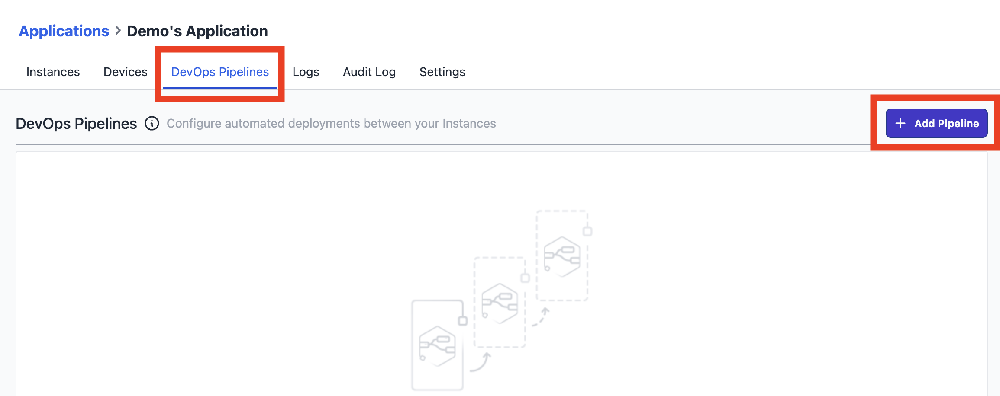
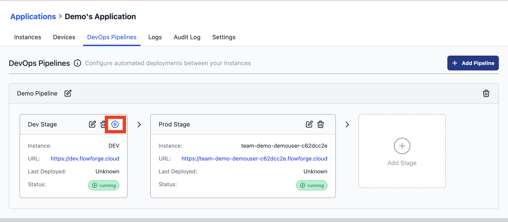

# Getting Started with FlowFuse

This guide will help you learn how to use the FlowFuse platform to quickly create new Node-RED applications after a successful [installation](/docs/install/introduction.md) or [sign-up](https://app.flowforge.com/account/create) for FlowFuse Cloud.

## Creating a Node-RED Instance

1. **Automatic Creation**: Your first Node-RED instance should be automatically created upon your initial login to FlowFuse. To access the Node-RED Editor, simply click on `Open Editor`.

    

2. **Additional Instance**: For utilizing various other FlowFuse features (e.g., DevOps Pipelines), it's highly beneficial to create a second Node-RED instance. A second Node-RED instance is included in both our Starter Tier and the Trial Phase of FlowFuse Cloud. To do so, select your application— in our example, "Demo's Application"— and click `Add Instance`.

    

[Learn more about Instances](#working-with-instances)

3. **Blueprint selection**: When creating a new Node-RED instance, you have the option to choose a blueprint tailored for specific use cases. For example, our "ANDON Operator Terminal" blueprint can be selected, and it will automatically configure the Node-RED instance, sparing you the need to start from scratch. While these templates are powerful out-of-the-box, they're also fully customizable, allowing you to tweak them to suit your unique requirements. Ultimately, blueprints speed up the learning curve for new users and expedite the solution-building process for experienced ones.

NOTE: _Some blueprints may only be available on certain tiers_

## Creating Your First Flow

FlowFuse published an [eBook on Node-RED development](https://flowfuse.com/ebooks/beginner-guide-to-a-professional-nodered/), which is a great resources when you're new
to Node-RED. You can also read our [blog post on creating your first flow](https://flowfuse.com/blog/2023/01/getting-started-with-node-red/).

## Creating Your First DevOps Pipeline

DevOps Pipelines enable you to link multiple Node-RED instances together in a deployment pipeline.

1. **Add a Pipeline**: Select your application and click `Add Pipeline`.

    

2. **Name Your Pipeline**: Enter a suitable name.

3. **Add Stages**: You can now add stages to your pipeline. In our example, we add a Development Stage and a Production Stage.

4. **Execute the Pipeline**: It is now easy to execute the pipeline with one click, promoting your recently created flow to your Production Node-RED instance.

    

[Learn more about DevOps Pipelines](devops-pipelines.md)

## Working with Devices 

FlowFuse supports managing Node-RED on your own hardware.

 - [Getting started with Devices](/docs/device-agent/introduction.md)

## Working with Teams

 - [Team management](/docs/user/team/README.md) - How to add and remove users from a team.
 - [Role based access control](/docs/user/team/README.md#role-based-access-control) - Which privileges are granted to different roles.

## Working with Files and Context

FlowFuse supports reading and writing persistent files and persistent context.

 - [Working with Files](/docs/user/filenodes.md)
 - [Working with Context](/docs/user/persistent-context.md)

 ## Working with Instances

 - [Snapshots](/docs/user/snapshots.md) - Create point-in-time backups of your Node-RED instances.
 - [Environment Variables](/docs/user/envvar.md) - How to manage Environment Variables in your Node-RED instances.
 - [Change Project Stack](/docs/user/changestack.md) - How to change an instance stack, for example to upgrade Node-RED.
 - [Logs](/docs/user/logs.md) - The Logs available in the FlowFuse application.
 - [Project Link Nodes](/docs/user/projectnodes.md) - Custom nodes for sending messages between Node-RED instances and devices.
 - [Instance Settings](/docs/user/instance-settings.md) - Settings available for Node-RED instances.
 - [Shared Team Library](/docs/user/shared-library.md) - Share flows easily between different Node-RED instances in your team.
 - [Node-RED Tools Plugin](/docs/migration/node-red-tools.md) - A plugin for Node-RED that lets you work with your flows outside of FlowFuse.
 - [High Availability mode](/docs/user/high-availability.md) - Run multiple copies of your instance for scaling and availability.
