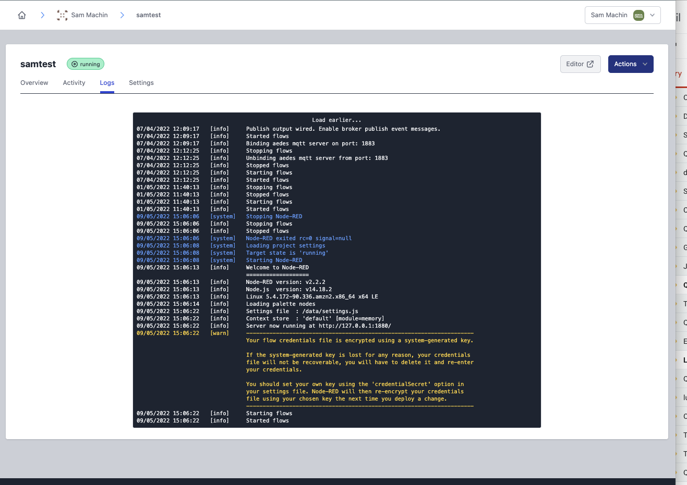
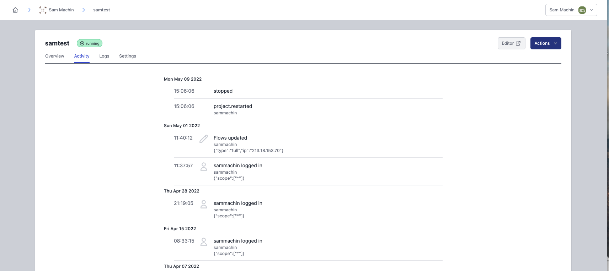
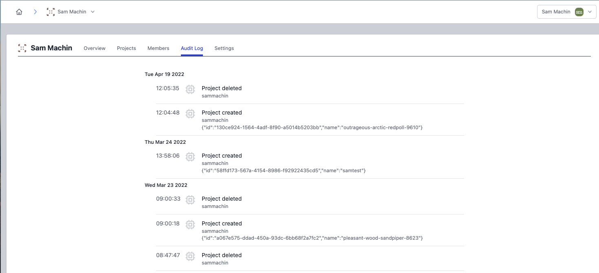

# Logs

FlowFuse presents log information in several different places depending on what you are interested in.

## Node-RED Logs

The Node-RED logs are available for all instances running within the platform.

They will contain information such as nodes being added and errors relating to your flows.

The log information is kept back to the last time the instance container was restarted, you can view older information on the `Load earlier...` link at the top of the log.

Node-RED logs can also be output from the Containers/Pods that run Instances on Docker or Kubernetes. This is enabled by the `forge.logPassthrough` option. More details can be found in the [Configuration](../install/configuration.md) documentation.

## Audit Log

The Audit Log tab on the application and instance views shows key events that have happened.

The events include:
 
 - User logging into the editor
 - Flows being updated
 - Nodes installed
 - Snapshots being created
 - Resource utilization warnings

This log contains all events since the instance was created. You can view older data using the `Load More...` link at the bottom of the log.

### Resource utilization warnings

If the CPU or memory usage exceeds 75% for more than 5 minutes, a warning will be displayed in the Audit Log, indicating that measures such as upgrading the instance are recommended.

## Team Audit Log

From the Team page the Audit Log shows events relating to the management of the team.

This includes:

 - Applications/Instances being created or deleted
 - Users being added/removed from the team

This log contains all events since the team was created. Tou can view older data using the `Load More...` link at the bottom of the log.

