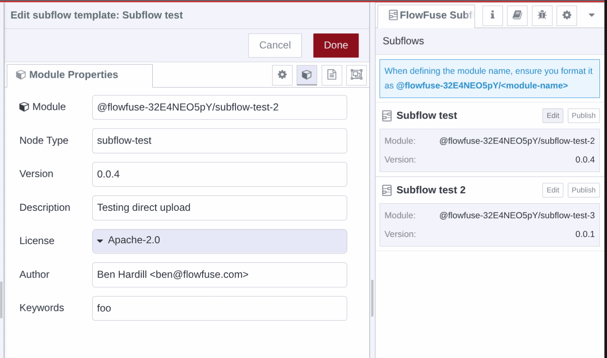
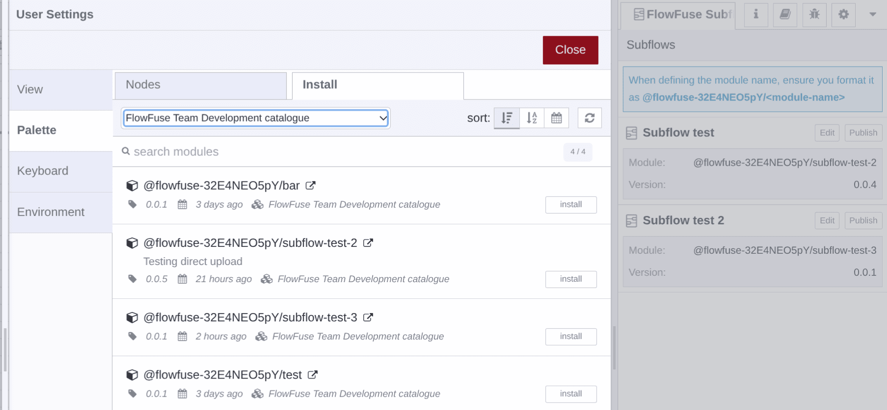

# Packaging Subflows as Custom Nodes

FlowFuse can package a Node-RED [subflow](https://nodered.org/docs/user-guide/editor/workspace/subflows) as an installable Node-RED node and publish it to your Team's Custom Nodes library. This lets you maintain a reusable block of logic or UI in one place and pull it into other instances like any other node, instead of copying flows between projects.


**Packaging is Hosted Instances only.** You can only *export* a subflow from a **Hosted Instance's** Node-RED editor — not from a Remote Instance (device). Once published, the resulting custom node can be **installed and used on any instance type**, Hosted or Remote.


## Requirements

- A **Hosted Instance** running the **latest Node-RED version** on **FlowFuse v2.21.0** or later
- A **FlowFuse Cloud Pro or Enterprise** team, or **Enterprise self-hosted**
- The [Shared Team Library](/docs/user/shared-library.md) feature enabled for the Team

## Packaging a subflow

1. In the Hosted Instance's **Node-RED editor**, build your flow and **convert it to a subflow**.
2. Open the **Subflow exporter** sidebar and select that subflow.
3. **Fill out the package details** — the node's **name** and **version** — and hit **Publish**.

{data-zoomable}
_The Subflow export sidebar in the Node-RED editor_

FlowFuse builds the subflow into a Node-RED node and publishes it to your Team's Custom Nodes registry, alongside any nodes published as [Custom Node Packages](/docs/user/custom-npm-packages.md).

### Name and version matter

The package details you enter are what the Team installs and updates against, so they aren't throwaway:

- **Name** — becomes the custom node's package name, scoped to your Team (e.g. `@flowfuse-<team id>/<node-name>`; the correct prefix is shown in the FlowFuse application). Keep it stable — republishing under the **same name updates that node** everywhere it's installed, while a **different name creates a separate node**.
- **Version** — bump it every time you republish. Instances see the new version in the Team Library catalogue and can update to it. This is the low-code **version control** for your custom nodes — no npm or Git to manage yourself.

## Installing the packaged node

The packaged subflow is added to the catalogue generated by your [Shared Team Library](/docs/user/shared-library.md). To use it in any other Node-RED instance in the Team — **Hosted or Remote**:

1. Open **Manage palette** in the Node-RED editor.
2. Find the packaged node in the catalogue and install it, just like any other node.

{data-zoomable}
_Packaged subflows appear in Manage palette, ready to install_

Because every instance installs from the same catalogue, you update the subflow in one place and re-publish, rather than editing copies across projects.

## Related

- [Custom Node Packages](/docs/user/custom-npm-packages.md) — publishing custom npm nodes to your Team's registry
- [Shared Team Library](/docs/user/shared-library.md) — how the Team Library and its catalogue work
- [Subflows](https://nodered.org/docs/user-guide/editor/workspace/subflows) — the Node-RED concept
