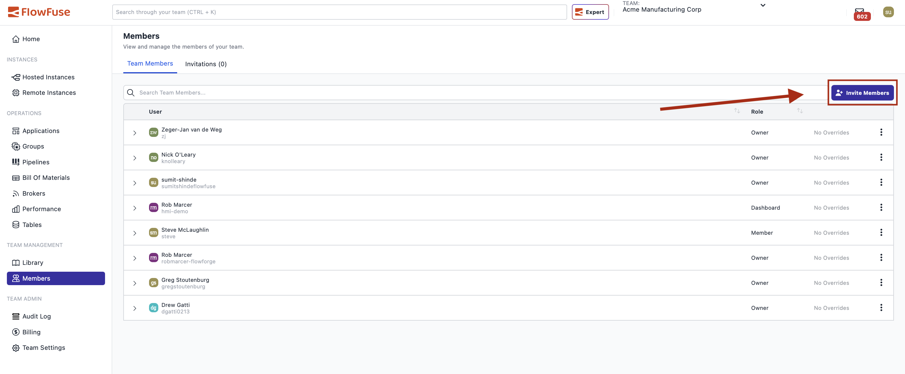
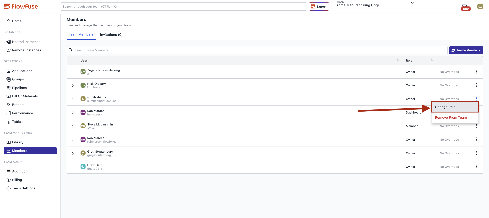
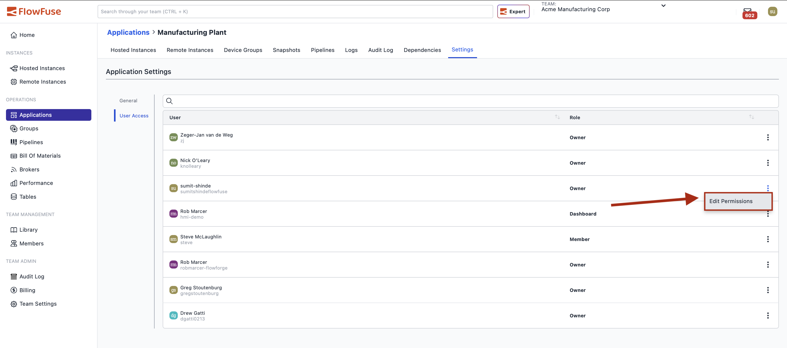
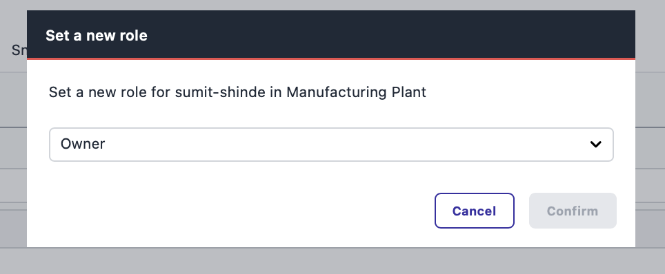

# Role-Based Access Control

Role-based access control (RBAC) determines what actions users can perform within FlowFuse. By assigning roles to team members, you control who can create, modify, view, or delete resources.

## RBAC Levels

FlowFuse provides role-based access control at two levels:

1. **Team-Level RBAC** - Defines default permissions across all team resources  
2. **Application-Level RBAC** - Overrides team-level permissions for specific applications

## Team-Level RBAC

Team-level roles establish baseline permissions for all resources within a team. Every team member is assigned one of four roles.

### Roles

**Owner**  
Full administrative control over the team, including managing settings, members, and all resources.

**Member**  
Can develop and manage flows, create snapshots, and modify environment variables. Cannot manage team settings or create/delete applications and instances.

**Viewer**  
Read-only access to view flows, instance details, and snapshots. Cannot make any modifications.

**Dashboard Only**  
Restricted access limited to viewing dashboards and HTTP endpoints only.

### Permissions

The table below shows which actions each role can perform.

| Action | Owner | Member | Viewer | Dashboard Only |
|--------|-------|--------|--------|----------------|
| **Team Management** |
| Manage Team Settings | ✓ | - | - | - |
| View Team Audit Log | ✓ | - | - | - |
| Invite User | ✓ | - | - | - |
| Change User Role | ✓ | - | - | - |
| Remove User from Team | ✓ | §1 | §1 | §1 |
| **Applications** |
| Create Application | ✓ | - | - | - |
| Delete Application | ✓ | - | - | - |
| Modify Application Settings | ✓ | - | - | - |
| View Application Logs | ✓ | ✓ | ✓ | - |
| **Instances** |
| Create Instance | ✓ | - | - | - |
| Delete Instance | ✓ | - | - | - |
| Copy Instance | ✓ | - | - | - |
| View Instance Details | ✓ | ✓ | ✓ | - |
| Start, Stop, Suspend Instance | ✓ | - | - | - |
| Modify Instance Settings | ✓ | - | - | - |
| Modify Environment Variables | ✓ | ✓ | - | - |
| Manage Assets | ✓ | ✓ | - | - |
| View Node-RED Logs | ✓ | ✓ | ✓ | - |
| Access Dashboard or HTTP Endpoint | ✓ | ✓ | ✓ | ✓ |
| **Flows** |
| Access Flow Editor | ✓ | ✓ | ✓ | - |
| Modify Flows | ✓ | ✓ | - | - |
| **Snapshots** |
| Create Snapshot | ✓ | ✓ | - | - |
| Restore Snapshot | ✓ | ✓ | - | - |
| Set as Device Target | ✓ | ✓ | - | - |
| View Snapshots | ✓ | ✓ | ✓ | - |
| Download Snapshot | ✓ | ✓ | - | - |
| Upload Snapshot | ✓ | - | - | - |
| Delete Snapshot | ✓ | - | - | - |
| **Devices** |
| View Devices | ✓ | ✓ | ✓ | - |
| Modify Device Settings | ✓ | - | - | - |
| Modify Environment Variables | ✓ | ✓ | - | - |
| Assign to/Remove from Application | ✓ | - | - | - |
| Assign to/Remove from Instance | ✓ | - | - | - |
| Delete Device | ✓ | - | - | - |
| Bulk Move Devices | ✓ | - | - | - |
| Bulk Delete Devices | ✓ | - | - | - |
| **Team Library** |
| Add an Item | ✓ | ✓ | - | - |
| Modify an Item | ✓ | ✓ | - | - |
| Delete an Item | ✓ | ✓ | - | - |
| **Team Broker** |
| Create Client | ✓ | ✓ | - | - |
| Delete Client | ✓ | ✓ | - | - |
| List Clients | ✓ | ✓ | - | - |

**Notes:**
* §1 Users in any role can remove themselves from a team  
* Platform Administrators have owner-level access to all teams but cannot access the Flow Editor

### Managing Team-Level Roles

Team Owners can manage member roles from the **Team Members** page.

#### Setting Roles When Inviting Members

When inviting a new team member:

1. Navigate to the Team Members
2. Click **Invite Member**

{data-zoomable}

3. Enter the user's username or email address  
4. Select the initial role (Owner, Member, Viewer, or Dashboard Only)

{data-zoomable}

5. Send the invitation

The invited user will have the assigned role once they accept the invitation.

#### Changing Existing Member Roles

To change a team member's role:

1. Navigate to the Team Members page  
2. Locate the user whose role you want to change  
3. Click the three-dot icon next to their username  
4. Select **Change Role**

{data-zoomable}

5. Choose the new role from the popup (similar to the invitation process)  
6. Confirm the change

**Note:** An Owner can only change their own role if at least one other Owner exists on the team.

## Application-Level RBAC

Application-Level RBAC enables you to control permissions at the individual application level within a team. This allows different team members to have different permission levels for different applications without creating multiple teams.

### Overview

Team-level roles define default permissions across all resources.  
Application-level roles override these defaults for specific applications.

When you assign an application-level role to a team member, it takes precedence over their team-level role **only** for that application. Their team-level role applies to all other applications.

### Available Roles

Application-level roles follow the same structure:

- **Owner** – Full control over the application  
- **Member** – Can develop and manage flows, create snapshots, modify environment variables  
- **Viewer** – Read-only access  
- **Dashboard Only** – Can only view dashboards and HTTP endpoints  

### Permission Hierarchy

1. If a user has an application-level role, that determines their permissions for the application.  
2. If not, their team-level role applies.  
3. Team Owners always have full access to all applications.

**Example:**  
A team-level *Member* is assigned *Viewer* permissions for one production application. They can only view flows in that application, but retain normal Member permissions for all others.

### Configuring Application-Level Roles

Team Owners can configure application-level roles:

1. Navigate to the application  
2. Open **Application Settings** → **User Access**  
3. Click the three-dot icon next to the user and select **Edit Permission**

{data-zoomable}

4. In the popup, assign the desired application-level role

{data-zoomable}

5. Changes apply immediately

To remove an application-level assignment, simply clear the role. The user will fall back to their team-level role for that application.
