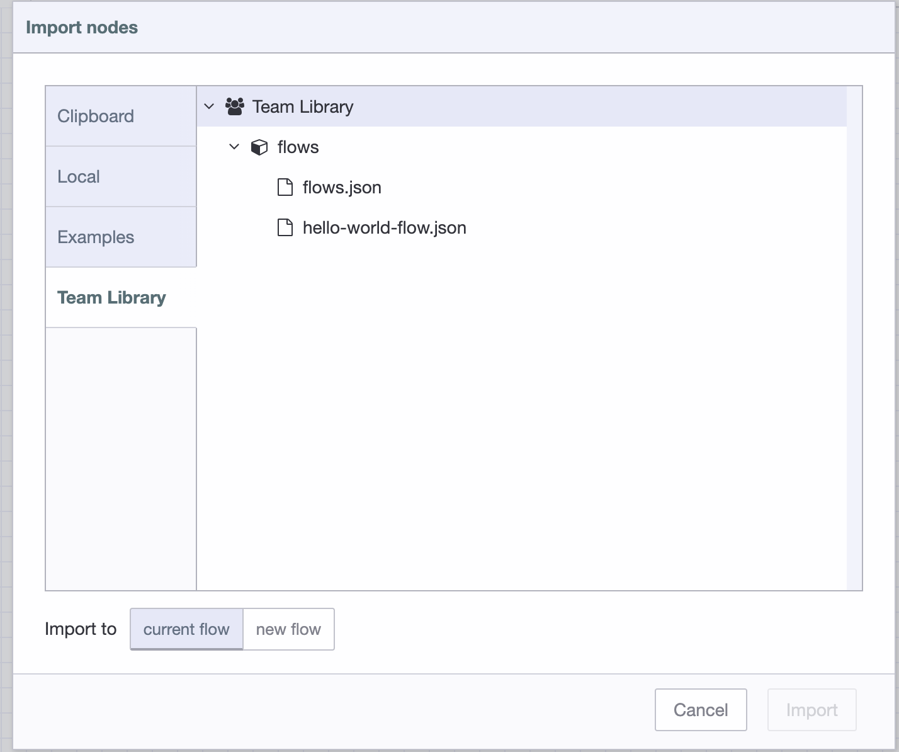

# Shared Team Library

Node-RED allows you to import and export **flows** and **functions** to a local library. This is helpful
for saving pieces of flow that you want to reuse.

With FlowForge Premium, each Node-RED instance has access to a Team Library that makes
it very easy to share flows and functions without having to manually copy them around.

For example, you may have a standard set of flows that you want each Node-RED instance
to include. By exporting them to the Team Library, you can quickly import them wherever
you want to use them.

A short video is available on [how to use this feature](https://www.youtube.com/watch?v=B7XK3TUklUU).

### Exporting flows

To export flows to the library within the Node-RED editor:

1. Select the nodes to be included
2. Open the Export Dialog (`Main Menu -> Export`, or `Ctrl/Cmd-E`)
3. Select the `Team Library` tab
4. Enter a name for the library entry
5. Click Export

### Importing flows

To import flows within the Node-RED editor:

1. Open the Import Dialog (`Main Menu -> Import`, or `Ctrl/Cmd-I`)
2. Select the 'Team Library' tab
3. Select the flow to import
4. Click Import
5. Place the imported nodes within your flows

### Viewing Team Library

It is possible to explore your Team Library within FlowForge by clicking "Library" in your Team options.

You can inspect the contents of any `.json` flow file, or `.js` function file here too.
