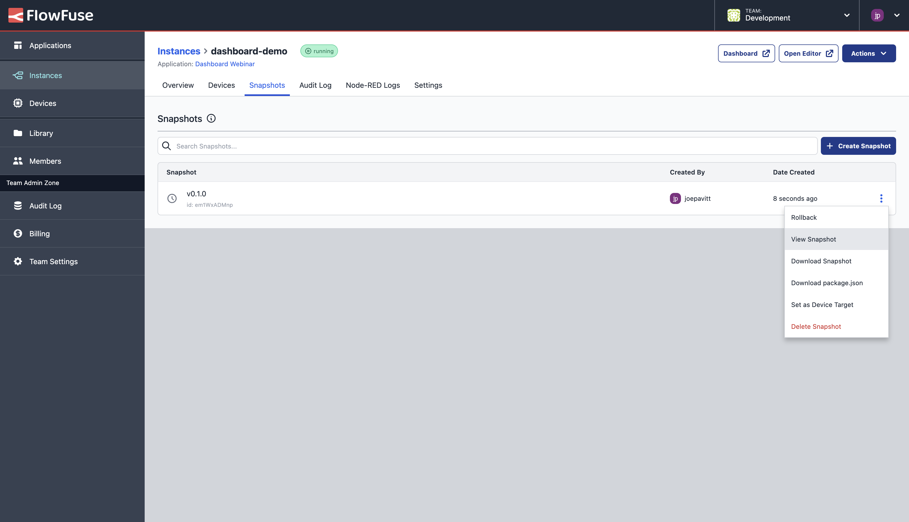
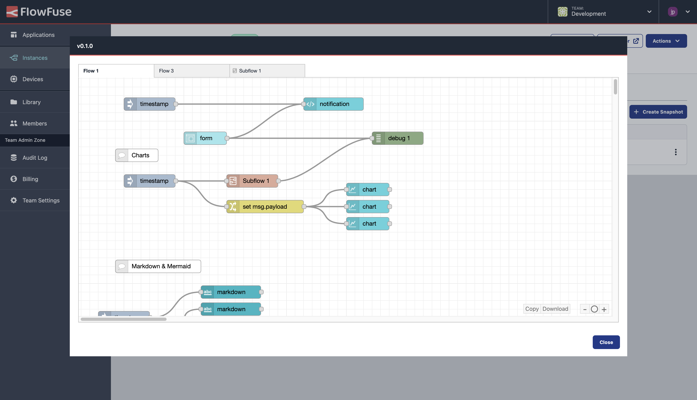

# Snapshots

A Snapshot is a point-in-time backup of a Node-RED instance. It captures:
1. The flows
2. Credentials
3. Environment variables
4. NPM packages, with locked versions
5. Runtime settings.

They can also be pushed to devices connected to the instance.

## Create a snapshot

To create a snapshot:

1. Go to the instance's page and select the **Snapshots** tab.
2. Click the **Create Snapshot** button.
3. You will be prompted to give the snapshot a **name** and optional **description**.
4. Click **Create**

The list of snapshots will update with the newly created entry at the top.

## Download a snapshot

A snapshot can be downloaded to your local machine for backup or sharing.

To download a snapshot:

1. Go to the instance's page and select the **Snapshots** tab.
2. Open the dropdown menu to the right of the snapshot you want to download and
   select the **Download Snapshot** option.

## Upload a snapshot

A snapshot can be uploaded to a Node-RED instance in FlowFuse.

To upload a snapshot:

1. Go to the instance's page and select the **Snapshots** tab.
2. Click the **Upload Snapshot** button.
3. Select the snapshot file from your local machine.
4. If the snapshot contains credentials, you will be asked to enter the credentials secret.
   This is the secret that was used to encrypt the credentials in the snapshot.
5. Update the name and description if required.
6. Click **Upload**

## Delete a snapshot

To delete a snapshot:

1. Go to the instance's page and select the **Snapshots** tab.
2. Open the dropdown menu to the right of the snapshot you want to delete and
   select the **Delete snapshot** option.
3. You will be asked to confirm - click **Delete** to continue.

*Note:* If the snapshot is the current **Device Target** snapshot, this will
cause any connected devices to stop running the snapshot when they next check in.

## Setting a Device Target snapshot

Snapshots are used to identify a version of the Node-RED instance that should be pushed
out to any connected devices. This allows you to develop you flows in FlowFuse
and only push out to the devices when it is ready.

### Instance owned devices
To set the **Device Target** of an instance owned device:

1. Go to the instance's page and select the **Snapshots** tab.
2. Open the dropdown menu to the right of the snapshot you want to set as the
   device target and select the **Set as Device Target** option.
3. You will be asked to confirm - click **Set Target** to continue.

This will cause the snapshot to be pushed out to any connected devices the
next time it checks in.

### Application owned devices
To set the **Device Target** of an application owned device:

1. Go to the devices's page and select the **Snapshots** tab.
2. In the list of snapshots available, a "Deploy Snapshot" button will be displayed
   for each snapshot as you hover over it.
3. You will be asked to confirm - click the **Confirm** button to set it as the target snapshot.

This will cause the snapshot to be pushed out to the device the
next time it checks in.

## Creating a Snapshot from a device

It is possible to create a Snapshot from a device that is connected to the platform.
The device must be set to Developer Mode for this to work.
See [Working with Devices](../device-agent/deploy.md) for
more information.

## Creating a Snapshot locally

Using the [Node-RED Tools Plugin](/docs/migration/node-red-tools.md) it is also possible to create
Snapshots in a local copy of Node-RED and push them back into your FlowFuse
managed Node-RED instances.

For more information, see the [Node-RED Tools Plugin guide](/docs/migration/node-red-tools.md).

## Auto Snapshots

FlowFuse can automatically create snapshots whenever flows are deployed
to the instance. This is useful for tracking changes, and rolling back.

FlowFuse will label these snapshots as "Auto snapshot - yyyy-mm-dd hh:mm:ss".
A limit of 10 auto snapshots will be kept, with the oldest being deleted when a new one is created.

Devices can optionally disable auto snapshots, in the developer mode tab. This can be helpful to
avoid excessive data usage when a device is in the field or on a cellular connection.

NOTE: This feature is only available to Team and Enterprise tier teams

## Previewing Snapshots

From any Snapshots tab, you can preview the flows of a snapshot by selecting the Snapshot's actions,
and selecting "View Snapshot".

_Screenshot to show the available "Actions" for a given Snapshot_

_Screenshot to an example flow preview for a Snapshot in FlowFuse_