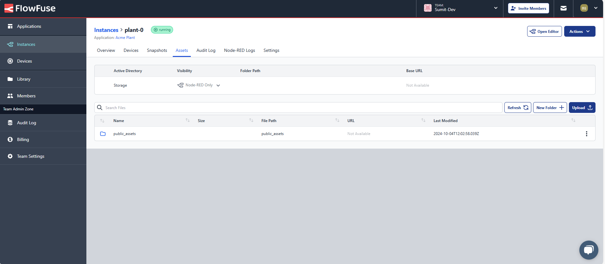
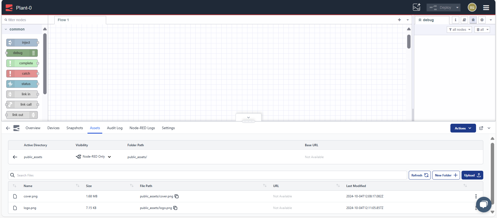
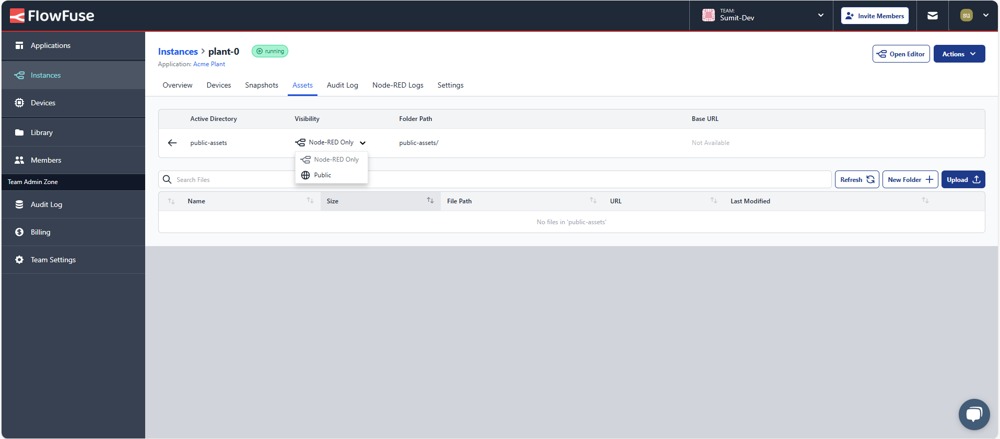
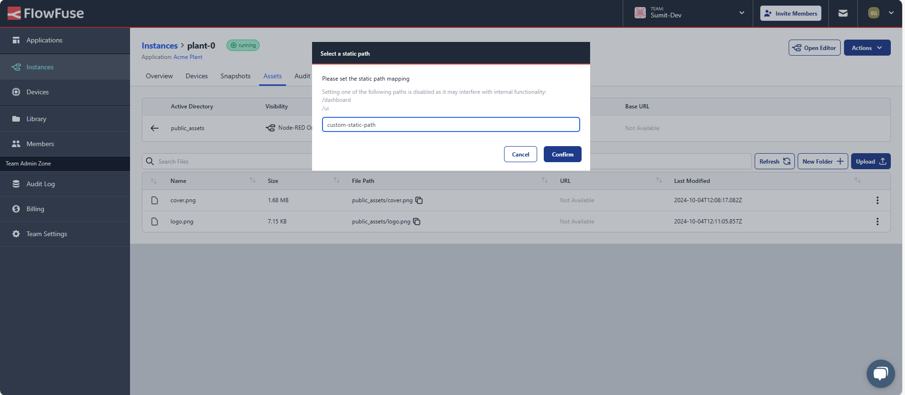
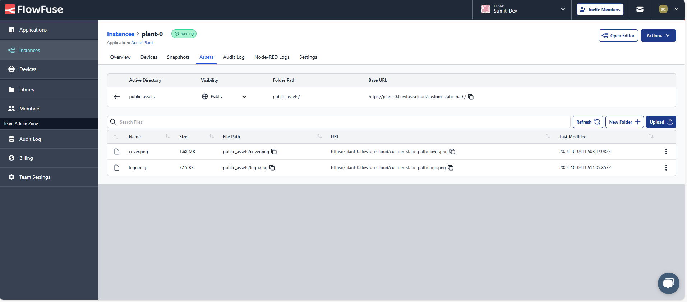

# Static asset service

Our platform now includes a Static Asset Service, enabling you to manage files seamlessly within your hosted Node-RED instances.

## What is Static asset service?

The Static Asset Service allows you to store files permanently within your FlowFuse Instances. Files that you upload, generate, or modify will remain accessible even after your session ends or the application restarts.

## Prerequisites

### FlowFuse Cloud

- A Instance Stack with a launcher version of 2.8.0 or greater.
- Team or Enterprise Team Type.

### Self-Hosted

This feature is available only on self-hosted Enterprise licensed versions of FlowFuse.

### Limitations

- Uploaded file sizes must not exceed 5MB.
- Unsupported characters (dependent on the operating system):
  - empty paths (eg: `/`, `//` or `\`, `\\`)
  - special chars: `*`, `:`
- Team permissions required: owner / member

## Getting Started

If the prerequisites are met, you will be able to use the Static Asset Service capabilities of FlowFuse Instances from two locations:

- Instance Assets tab within the **Instance Details** page.
  {data-zoomable}
- Instance Assets tab within the **Immersive Editor**.
  {data-zoomable}

The following steps assume that you have navigated to one of these locations and have the assets tab opened.

### Files

#### Uploading a File

To upload a file, click the 'Upload' button, select your desired file, and click confirm. This will upload the file to the current storage folder.

*Note: Uploading a file with the same name as an existing one will overwrite the existing file.*

#### Deleting a File

Navigate to the file you want to delete, click on the kebab menu (three vertical dots) associated with the file, select 'Delete File,' and confirm when prompted.

#### Renaming a File

Currently, this feature is not supported. To rename a file, upload the file with the desired name and delete the old one from the instance's Persistent Storage.

*Caution: Renaming a file will also affect any linked files or relative paths to that file in the Node-RED instance.*

### Folders

#### Creating a Folder

To create a folder, click the 'New Folder' button, enter your desired folder name, and click confirm. This will create the folder inside the current directory.

#### Deleting a Folder

Navigate to the folder you want to delete, click on the kebab menu associated with the folder, select 'Delete Folder,' and confirm when prompted.

*Caution: Deleting a folder that contains files or other folders will permanently delete all nested files and folders.*

#### Renaming a Folder

Navigate to the folder you want to rename, click on the kebab menu, select 'Edit Folder,' and confirm the new name when prompted.

*Caution: Renaming a folder will also affect any linked files or relative paths of nested files or directories in the Node-RED instance.*

#### Folder Navigation

You can navigate through folder structures by clicking on any folder and return by using the Working Directory Breadcrumbs located at the top of the Search Files input.

#### Folder Visibility

Following the 2.9.0 release, you can set the folder's visibility using the Visibility selector found in the Navigation section. 
This means that users can set the visibility of their uploaded files to public and make them accessible outside the node-red instance itself.

When setting a folder's visibility to public you are required to set a static file path on which the files will be served by your instance.

{data-zoomable}

{data-zoomable}

{data-zoomable}

Considerations:
- Visibility and static path maps can be set on folders only.
- Any change in visibility settings require an instance restart in order for the changes to take effect.

### How to use

The following video is a quick demonstration on how to use assets inside a FlowFuse Node RED Instance:

<video controls width="800">
  <source src="https://website-data.s3.eu-west-1.amazonaws.com/Assets+Service+Demo.mp4" type="video/mp4">
  Your browser does not support the video tag.
</video>
