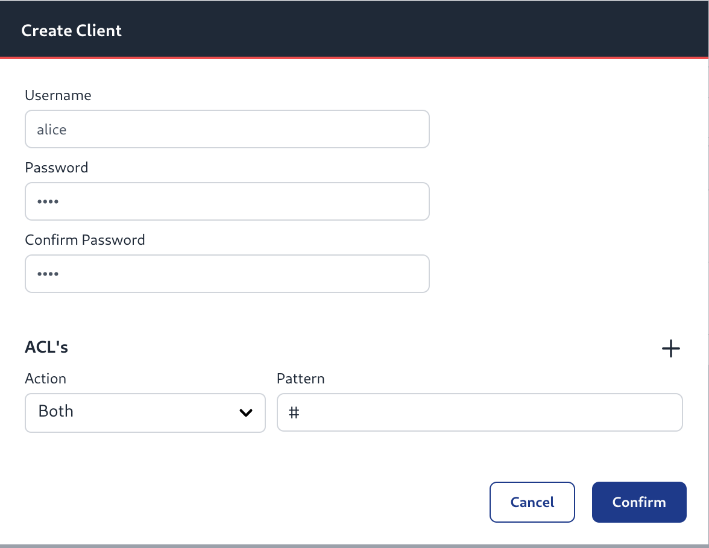
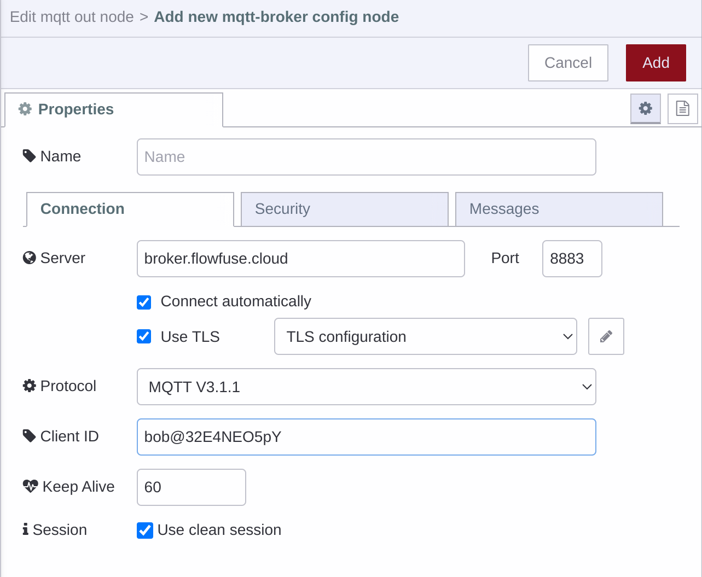
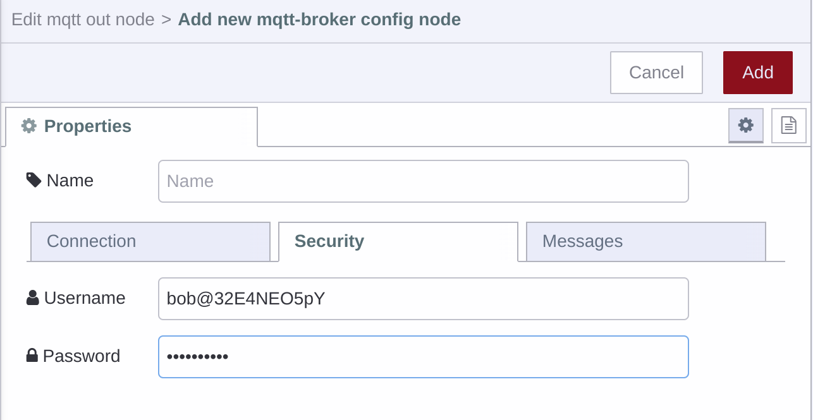

# Getting Started with Team Broker

When FlowFuse is deployed with an Enterprise license from v2.11.0 onwards comes with the option to enable a MQTT broker for each Team.

This is a single shared MQTT broker, but each team has their own separate topic space and the ability to provision credentials for clients.

## What the Team Broker is

The Team Broker is a multi-tenant MQTT broker service built into the FlowFuse platform:
one broker instance, managed by the platform, where every team gets its own fully
isolated topic space and can provision client credentials in a self-service way. It
removes the need to install and operate a separate broker to move MQTT data between
devices, Node-RED instances and other clients.

Under the hood the Team Broker is provided by [EMQX](https://www.emqx.io/), and the
platform integrates with EMQX-specific capabilities for client authentication, per-team
topic isolation and bridging. The Team Broker cannot be backed by a different broker
(see [MQTT Broker configuration](/docs/install/configuration.md)). If your company
already operates its own MQTT broker, that broker can still be connected to FlowFuse
as an external broker to browse its topic hierarchy alongside the Team Broker, and
Node-RED instances can connect to it directly as a regular MQTT client.

## Foreword
FlowFuse offers zero config MQTT integration with the Team Broker via the [FlowFuse MQTT Nodes](/docs/user/mqtt-nodes/) that greatly simplifies the whole process by removing the need for manual configuration.

If you wish to continue using traditional MQTT clients, the below sections will guide you through the process of creating clients and connecting to the broker.

## Creating Clients

When creating clients you can specify a username, it will prepended to the the Team's id e.g.  `alice` will become `alice@32E4NEO5pY`.

This username should also be used as the MQTT Client ID in order to connect to the broker. Examples of how to do this are in the [next section](#connecting-to-the-broker).



## Connecting to the Broker

The broker for FlowFuse Cloud is available on `broker.flowfuse.cloud` and supports the following connection types:

 - MQTT on port `1883`
 - MQTT over TLS on port `8883`
 - MQTT over secure WebSockets on port `443`

 For Self Hosted instances, please ask your Administrator for hostname and ports.

 You can connect to the broker using any MQTT client, for example `mosquitto_sub`

 ```
 mosquitto_sub -u "alice@32E4NEO5pY" -i "alice@32E4NEO5pY" -P "password" -h broker.flowfuse.cloud -t "#"
 ```

 Please note that username **must** also be used for the client id to connect to the team broker. This does mean that each 
 username/password can only be used with a single MQTT client at a time.

 Or in Node-RED as follows

 
 
 