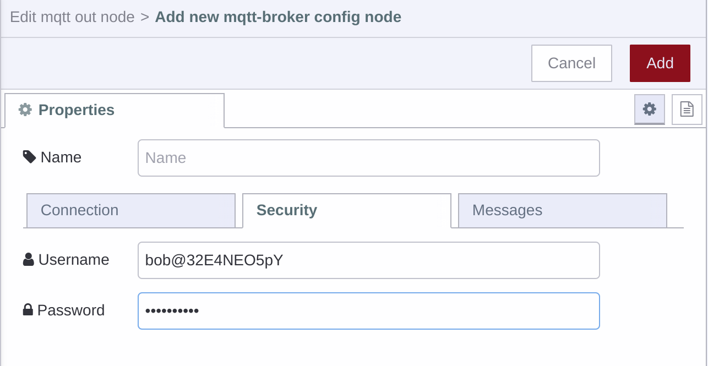

# Getting Started with Team Broker

When FlowFuse is deployed with an Enterprise license from v2.11.0 onwards comes with the option to enable a MQTT broker for each Team.

This is a single shared MQTT broker, but each team has their own separate topic space and the ability to provision credentials for clients.

## Creating Clients

When creating clients you can specify a username, it will prepended to the the Team's id e.g.  `alice` will become `alice@32E4NEO5pY`.

This username should also be used as the MQTT Client ID in order to connect to the broker. Examples of how to do this are in the [next section](#connecting-to-the-broker).


## Connecting to the Broker

The broker for FlowFuse Cloud is available on `broker.flowfuse.cloud` and supports the following connection types:

 - MQTT on port `1883`
 - MQTT over TLS on port `8883`
 - MQTT over secure WebSockets on port `443`

 For Self Hosted instances, please ask your Administrator for hostname and ports.

 You can connect to the broker using any MQTT client, for example `mosquitto_sub`

 ```
 mosquitto_sub -u "alice@32E4NEO5pY" -i "alice@32E4NEO5pY" -P "password" -h broker.flowfuse.cloud -t "#"
 ```

 Or in Node-RED as follows

 
 
 