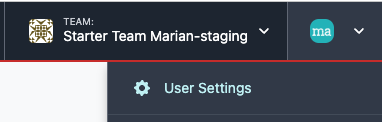
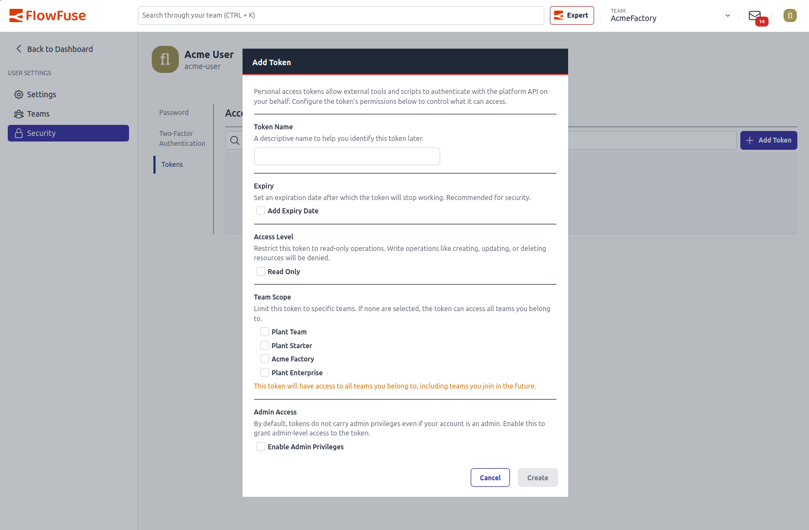

# User Settings

Access the FlowFuse User settings by clicking on your username in the top right corner.

## Settings

In the Settings section, you can modify various characteristics of your personal user account:

- **Username**
- **Name**
- **E-Mail** (modifiable only if SSO is disabled)
- **Theme** - choose **Light**, **Dark**, or **System** for the FlowFuse interface. **System** follows your operating system setting and updates live when it changes. Your choice is saved per browser. This applies to the FlowFuse application only; the Node-RED editor and Dashboard manage their own themes separately.

Additionally, you can select a default Team, especially useful if your account is associated with multiple Teams.

## Teams

The Teams tab provides an overview of all teams associated with your User account. Here, you can also view and respond to open invitations.

## Security

### Change Password

Under the Security section, you have the option to change your password. For this, you need to enter your current and new password.

### Two-Factor Authentication

Two-factor authentication adds an extra layer of security to your account. It requires a second form of identification when logging in. Note that when signing in via your SSO provider, you will not be prompted for a two-factor authentication code.

To set up Two-factor authentication, click on `Enable two factor authentication` and follow the instructions.

### Personal Access Tokens

Personal Access Tokens are useful for interacting with [FlowFuse APIs](https://flowfuse.com/docs/api/). You can set these tokens to have a limited or unlimited lifespan. Tokens can be revoked at any time by removing them from your account. Remember, tokens with an expiry date will automatically delete upon reaching that date. It's important to note that the token value is only displayed once, at the time of creation. There is no way to retrieve the token value after this point.

### Creating a Token

1. Click **Add Token**.
2. Enter a name for the token.
3. Optionally, tick **Add Expiry Date** and choose a date.
4. Configure the token's scope (see below).
5. Click **Create**.

{data-zoomable}

### Scoping a Token

- **Read Only** - restricts the token to read-only operations. Write operations, such as creating, updating, or deleting resources, are denied.
- **Team Scope** - limits the token to specific Teams. If no Teams are selected, the token can access every Team you belong to, including Teams you join in the future. If specific Teams are selected, the token does not automatically gain access to any new Team you join later - you need to edit the token to add it.
- **Admin Access** - only shown if your account has admin privileges. A token does not carry admin privileges by default, even if your account does; this must be enabled explicitly for that token.

These restrictions can only narrow a token's access - a token can never do more than your own account is permitted to do.is

